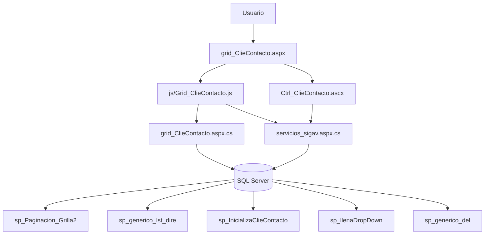
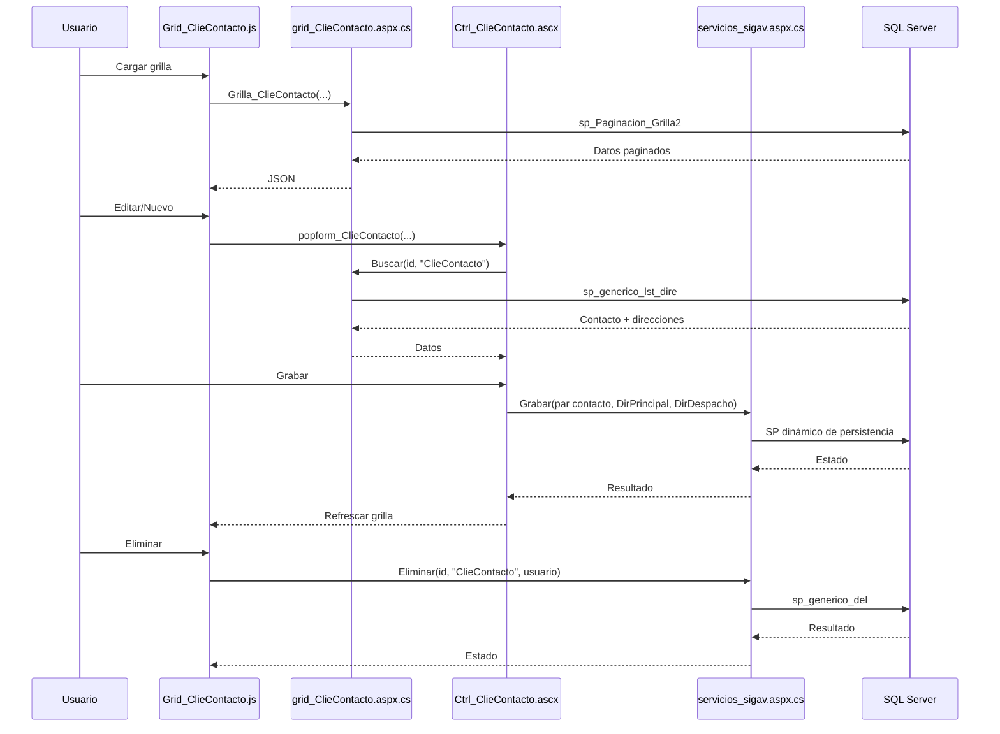

# Análisis de `grid_ClieContacto.aspx`

## 1) Descripción y función

`grid_ClieContacto.aspx` administra el CRUD de contactos de clientes (`ClieContacto`) incluyendo datos de contacto y dos bloques de dirección (principal y despacho).

Funcionalidades:
- grilla `jqGrid` con paginación, filtros y exportación,
- formulario modal con pestañas (`Ctrl_ClieContacto.ascx`),
- persistencia vía servicios genéricos,
- visualización detallada en `form_ClieContacto.aspx`.

---

## 2) Dependencias

### Archivos
- `grid_ClieContacto.aspx`
- `grid_ClieContacto.aspx.cs`
- `js/Grid_ClieContacto.js`
- `ControlUser/Ctrl_ClieContacto.ascx`
- `ControlUser/Ctrl_ClieContacto.ascx.cs`

### Métodos C# relevantes
En `grid_ClieContacto.aspx.cs`:
- `InicializaClieContacto(idUsuario)`
- `Buscar(id_reg, tabla)` (usa `sp_generico_lst_dire`)
- `Grilla_ClieContacto(...)`
- DTO `ClieContacto`
- `JQGridJsonResponse_ClieContacto`

En `servicios/servicios_sigav.aspx.cs`:
- `Grabar(...)`
- `Eliminar(...)`
- `CargaDDL(...)`
- `Caption_Option(...)`

### Objetos JS relevantes
En `Grid_ClieContacto.js`:
- `Grilla_ClieContacto(...)`
- `Accion_ClieContacto(...)`
- `Caption(...)`, `Filtros(...)`

En `Ctrl_ClieContacto.ascx`:
- `popform_ClieContacto(...)`
- `BuscarDatos_ClieContacto(...)`
- `Grabar_ClieContacto(...)`
- `ParametrosGrabar_ClieContacto`, `ParametrosGrabar_DirPrincipal`, `ParametrosGrabar_DirDespacho`
- `DatosValidacion_ClieContacto(...)`
- DDL en cascada para dirección principal/despacho:
  - `DDLPrincipal_IdGeoPais/Ciudad/Comuna`
  - `DDLDespacho_IdGeoPais/Ciudad/Comuna`
  - `DDLIdClieCliente`, `DDLIdClieTipoContacto`

### Procedimientos almacenados detectados
- `sp_Paginacion_Grilla2`
- `sp_generico_lst_dire`
- `sp_generico_sel` (modo detalle en control code-behind)
- `sp_InicializaClieContacto`
- `sp_llenaDropDown`
- `sp_generico_del` (eliminación genérica vía servicio)

---

## 3) Flujo CRUD e interacciones

## Create
1. `Accion_ClieContacto(...,0)` abre modal.
2. Se limpian datos y se inicializan combos (cliente, tipo contacto, geografía principal/despacho).
3. Usuario completa datos de contacto + direcciones.
4. `Grabar_ClieContacto` llama `servicios_sigav.aspx/Grabar` pasando:
   - parámetros del contacto,
   - parámetros de dirección principal,
   - parámetros de dirección despacho.
5. Se refresca grilla.

## Read
- Grilla: `Grid_ClieContacto.aspx/Grilla_ClieContacto` -> `sp_Paginacion_Grilla2`.
- Edit/View: `Buscar` -> `sp_generico_lst_dire` para recuperar contacto y direcciones.
- En modo visualización, `Ctrl_ClieContacto.ascx.cs` carga por `sp_generico_sel` y deshabilita controles.

## Update
1. `Accion_ClieContacto(...,1)` abre modal.
2. `BuscarDatos_ClieContacto` hidrata campos y combos.
3. Validaciones (`DatosValidacion_ClieContacto`) y grabación.
4. `Grabar` actualiza registro y direcciones relacionadas.

## Delete
1. Acción 3 -> `eliminareg`.
2. Confirmación + `servicios_sigav.aspx/Eliminar`.
3. Persistencia por `sp_generico_del`.
4. Recarga de grilla.

## Clone / View
- `accion=2`: clonado de registro reutilizando flujo de edición.
- `accion=4`: abre formulario de solo lectura.

---

## 4) Diagrama de objetos

### Diagrama de proceso CRUD

---

## 5) Relaciones de datos

`ClieContacto` depende de `ClieCliente` y `ClieTipoContacto`

Para información detallada sobre esta y otras relaciones del sistema, consultar:  
📘 **[Relaciones entre Entidades - Sistema SIGAV](../../Relaciones_Entidades.md#cliecontacto-a-cliecliente)**

---

## 6) Características especiales

### Gestión de direcciones múltiples
- **Dirección Principal**: conjunto completo de campos de dirección (país, ciudad, comuna, dirección, teléfono)
- **Dirección de Despacho**: segunda dirección independiente con los mismos campos
- Ambas direcciones se persisten en la misma llamada de grabación

### Cascada de ubicación geográfica
- Dropdowns en cascada para selección jerárquica: País → Ciudad → Comuna
- Implementados tanto para dirección principal como para despacho
- Funciones: `DDLPrincipal_IdGeoPais`, `DDLPrincipal_IdGeoCiudad`, `DDLPrincipal_IdGeoComuna`
- Funciones: `DDLDespacho_IdGeoPais`, `DDLDespacho_IdGeoCiudad`, `DDLDespacho_IdGeoComuna`

### Validaciones complejas
- **Email**: validación con regex RFC 5322
- **Teléfonos**: validación de formato numérico
- **RUT**: formato y dígito verificador
- **Campos obligatorios**: Cliente, Nombre, Tipo de Contacto

### Interfaz con pestañas
- Organización del formulario en pestañas (jQuery UI Tabs)
- Permite separar información de contacto de información de direcciones
- Mejora la usabilidad en formularios con muchos campos

### Filtros dinámicos
- Soporte para 3 filtros simultáneos
- Columnas filtrables generadas dinámicamente
- Filtros persistentes entre recargas

### Responsividad
- Ancho de columnas calculado como porcentajes de ventana
- Alto de grilla adaptativo
- Filas por página calculadas dinámicamente

### Seguridad
- Validación de perfil por usuario
- Log de accesos y eventos
- Parámetros encriptados en URLs

### Exportación
- Botones para exportar a Excel y CSV
- Función `ExportGrilla` con delimitadores configurables

---

## 7) Estructura de datos

### Tabla ClieContacto (inferida)

| Campo | Tipo | Null | Descripción |
|-------|------|------|-------------|
| IdClieContacto | int | No | PK, Identity |
| IdClieCliente | int | No | FK a ClieCliente |
| IdClieTipoContacto | int | No | FK a ClieTipoContacto |
| Nombre | varchar(100) | No | Nombre del contacto |
| Cargo | varchar(50) | Sí | Cargo del contacto |
| Email | varchar(100) | Sí | Email del contacto |
| TelefonoPrincipal | varchar(20) | Sí | Teléfono principal |
| TelefonoMovil | varchar(20) | Sí | Teléfono móvil |
| Rut | varchar(12) | Sí | RUT del contacto |
| FechaCreacion | datetime | Sí | Timestamp de creación |
| UsuarioCreacion | varchar(50) | Sí | Usuario que creó el registro |
| FechaModificacion | datetime | Sí | Timestamp de última modificación |
| UsuarioModificacion | varchar(50) | Sí | Usuario que modificó el registro |
| Eliminado | bit | Sí | Flag de soft delete |

### Tablas de Dirección (inferidas)

#### DirPrincipal

| Campo | Tipo | Null | Descripción |
|-------|------|------|-------------|
| IdDirPrincipal | int | No | PK, Identity |
| IdClieContacto | int | No | FK a ClieContacto |
| IdGeoPais | int | Sí | FK a GeoPais |
| IdGeoCiudad | int | Sí | FK a GeoCiudad |
| IdGeoComuna | int | Sí | FK a GeoComuna |
| Direccion | varchar(200) | Sí | Dirección completa |
| Telefono | varchar(20) | Sí | Teléfono de la dirección |

#### DirDespacho

| Campo | Tipo | Null | Descripción |
|-------|------|------|-------------|
| IdDirDespacho | int | No | PK, Identity |
| IdClieContacto | int | No | FK a ClieContacto |
| IdGeoPais | int | Sí | FK a GeoPais |
| IdGeoCiudad | int | Sí | FK a GeoCiudad |
| IdGeoComuna | int | Sí | FK a GeoComuna |
| Direccion | varchar(200) | Sí | Dirección completa |
| Telefono | varchar(20) | Sí | Teléfono de la dirección |

### Índices (sugeridos)
- PK en `IdClieContacto`
- FK en `IdClieCliente`
- FK en `IdClieTipoContacto`
- Index en `Nombre` para búsquedas
- Index en `Email` para búsquedas
- Index filtrado en `Eliminado = 0` para consultas activas

---

## 8) Resumen

`grid_ClieContacto.aspx` implementa un CRUD WebForms completo para la gestión de contactos de clientes con manejo avanzado de direcciones, con:

- **jqGrid** con paginación, ordenamiento y filtros múltiples
- **Modal jQuery UI con pestañas** para organizar información de contacto y direcciones
- **Gestión de direcciones múltiples** (principal y despacho) en una sola transacción
- **Cascada geográfica** para selección jerárquica de ubicación
- **Validaciones complejas** de email, teléfonos y RUT
- **Servicios genéricos** de persistencia y eliminación
- **SPs especializados** para consulta con direcciones (`sp_generico_lst_dire`)
- **Exportación** a Excel y CSV
- **Seguridad** basada en perfiles y auditoría completa
- **Diseño responsivo** adaptado a tamaño de ventana

Es un componente **detalle del módulo de clientes**, con complejidad media-alta debido a la gestión de múltiples direcciones y cascadas geográficas. Permite mantener información completa de contactos por cliente con trazabilidad y validaciones robustas.

### Casos de uso principales

1. **Gestión de contactos**: crear, modificar y eliminar contactos de clientes
2. **Administración de direcciones**: mantener direcciones principal y de despacho por contacto
3. **Búsqueda avanzada**: localizar contactos por múltiples criterios
4. **Exportación**: generar listados de contactos en Excel/CSV
5. **Integración**: servir como base para comunicaciones, envíos y gestión comercial
