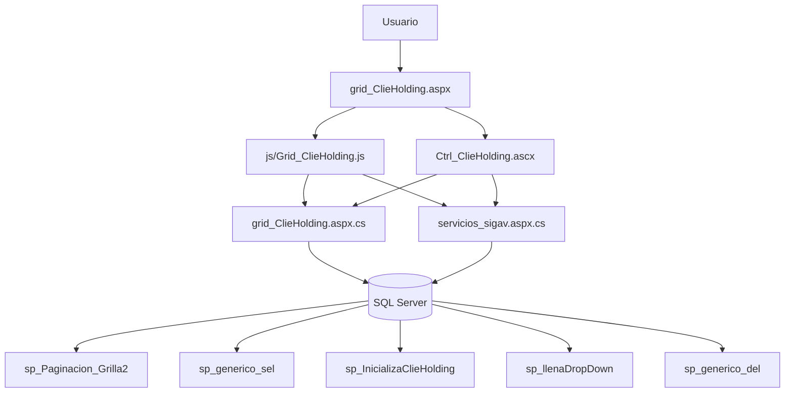
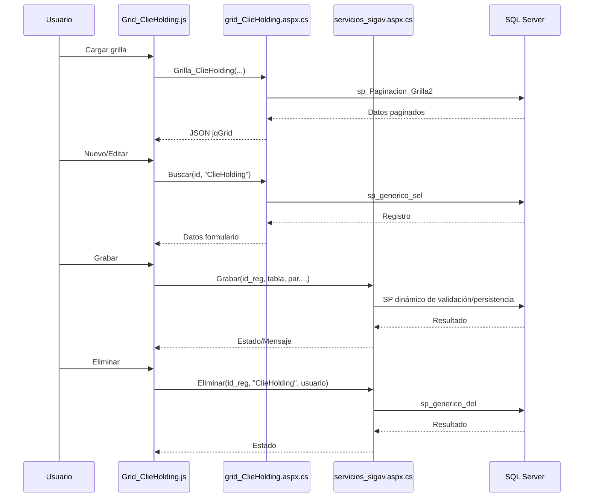

# Análisis de `grid_ClieHolding.aspx`

## 1) Descripción y función

`grid_ClieHolding.aspx` implementa el mantenimiento CRUD de la entidad `ClieHolding` (Holding de clientes).

Funcionalidades principales:
- listado paginado y filtrado en `jqGrid`,
- alta/edición/clonación en modal (`Ctrl_ClieHolding.ascx`),
- eliminación con confirmación,
- visualización en formulario de solo lectura (`form_ClieHolding.aspx`).

---

## 2) Dependencias

### Archivos UI/JS
- `grid_ClieHolding.aspx`
- `js/Grid_ClieHolding.js`
- `ControlUser/Ctrl_ClieHolding.ascx`
- `ControlUser/Ctrl_ClieHolding.ascx.cs`

### C# / WebMethods
- `grid_ClieHolding.aspx.cs`
  - `InicializaClieHolding(idUsuario)`
  - `Buscar(id_reg, tabla)`
  - `Grilla_ClieHolding(...)`
  - clase DTO `ClieHolding`
  - clase `JQGridJsonResponse_ClieHolding`

### Servicios comunes usados
- `servicios/servicios_sigav.aspx.cs`
  - `Grabar(...)`
  - `Eliminar(...)`
  - `CargaDDL(...)`
  - `Caption_Option(...)`

### Procedimientos almacenados detectados
- `sp_Paginacion_Grilla2`
- `sp_generico_sel`
- `sp_InicializaClieHolding`
- `sp_llenaDropDown` (en control code-behind)
- `sp_generico_del` (vía `Eliminar` genérico)

---

## 3) Flujo CRUD e interacciones

## Create
1. `Accion_ClieHolding(..., 0)` abre `popform_ClieHolding`.
2. Se limpian campos (`LimpiaDatos_ClieHolding`) y se carga `IdMaeEmpresa` vía `CargaDDL`.
3. `Grabar_ClieHolding` llama `servicios_sigav.aspx/Grabar` con parámetros (`IdMaeEmpresa`, `Nombre`).
4. Se refresca grilla con `Grilla_ClieHolding(1)`.

## Read
- La grilla llama a `Grid_ClieHolding.aspx/Grilla_ClieHolding`.
- El WebMethod ejecuta `sp_Paginacion_Grilla2` y retorna JSON para `jqGrid`.
- Para edición/visualización se usa `Buscar(...)` con `sp_generico_sel`.

## Update
1. Botón editar (`Accion_ClieHolding(...,1)`) abre modal.
2. `BuscarDatos_ClieHolding` consume `grid_ClieHolding.aspx/Buscar`.
3. Tras validar (`DatosValidacion_ClieHolding`), `Grabar` persiste cambios.

## Delete
1. Botón eliminar llama `eliminareg(id, 'ClieHolding', ...)`.
2. Confirmación y llamada a `servicios_sigav.aspx/Eliminar`.
3. Backend usa eliminación genérica (`sp_generico_del`) y se recarga la grilla.

## Clone / View
- `accion=2`: clona reutilizando flujo de formulario + grabación.
- `accion=4`: abre `form_ClieHolding.aspx` para visualización.

---

## 4) Diagrama de objetos

### Diagrama de proceso CRUD

---

## 5) Relaciones de datos

`ClieHolding` puede tener relaciones con `ClieCliente` y `MaeEmpresa`.

Para información detallada sobre esta y otras relaciones del sistema, consultar:  
📘 **[Relaciones entre Entidades - Sistema SIGAV](../../Relaciones_Entidades.md#clieholding-a-maeempresa)**

---

## 6) Características especiales

### Simplicidad
- Componente con estructura simple: solo 2 campos principales (Empresa y Nombre)
- Diseño minimalista enfocado en catálogo básico

### Filtros dinámicos
- Soporte para 3 filtros simultáneos
- Columnas filtrables generadas dinámicamente
- Filtros persistentes entre recargas

### Responsividad
- Ancho de columnas calculado como porcentajes de ventana
- Alto de grilla adaptativo
- Filas por página calculadas dinámicamente

### Seguridad
- Validación de perfil por usuario
- Log de accesos y eventos
- Parámetros encriptados en URLs

### Exportación
- Botones para exportar a Excel y CSV
- Función `ExportGrilla` con delimitadores configurables

---

## 7) Estructura de datos

### Tabla ClieHolding (inferida)

| Campo | Tipo | Null | Descripción |
|-------|------|------|-------------|
| IdClieHolding | int | No | PK, Identity |
| IdMaeEmpresa | int | Sí | FK a MaeEmpresa |
| Nombre | varchar(100) | No | Nombre del holding |
| FechaCreacion | datetime | Sí | Timestamp de creación |
| UsuarioCreacion | varchar(50) | Sí | Usuario que creó el registro |
| FechaModificacion | datetime | Sí | Timestamp de última modificación |
| UsuarioModificacion | varchar(50) | Sí | Usuario que modificó el registro |
| Eliminado | bit | Sí | Flag de soft delete |

### Índices (sugeridos)
- PK en `IdClieHolding`
- FK en `IdMaeEmpresa`
- Index en `Nombre` para búsquedas
- Index filtrado en `Eliminado = 0` para consultas activas

---

## 8) Resumen

`grid_ClieHolding.aspx` implementa un CRUD WebForms simplificado para la gestión de holdings de clientes, con:

- **jqGrid** con paginación, ordenamiento y filtros múltiples
- **Modal jQuery UI** para edición con validaciones básicas
- **Servicios genéricos** de persistencia y eliminación
- **SPs parametrizados** para consulta y manipulación de datos
- **Relación con empresas** mediante FK a MaeEmpresa
- **Exportación** a Excel y CSV
- **Seguridad** basada en perfiles y auditoría completa
- **Diseño responsivo** adaptado a tamaño de ventana

Es un componente **maestro simple** para mantener catálogos de holdings empresariales, con estructura minimalista y alta reutilización del framework genérico de la aplicación.

### Casos de uso principales

1. **Gestión de holdings**: crear y mantener grupos empresariales de clientes
2. **Búsqueda y consulta**: filtrar y exportar catálogos de holdings
3. **Trazabilidad**: auditar creaciones, modificaciones y eliminaciones
4. **Integración**: servir como agrupador para clientes relacionados empresarialmente
