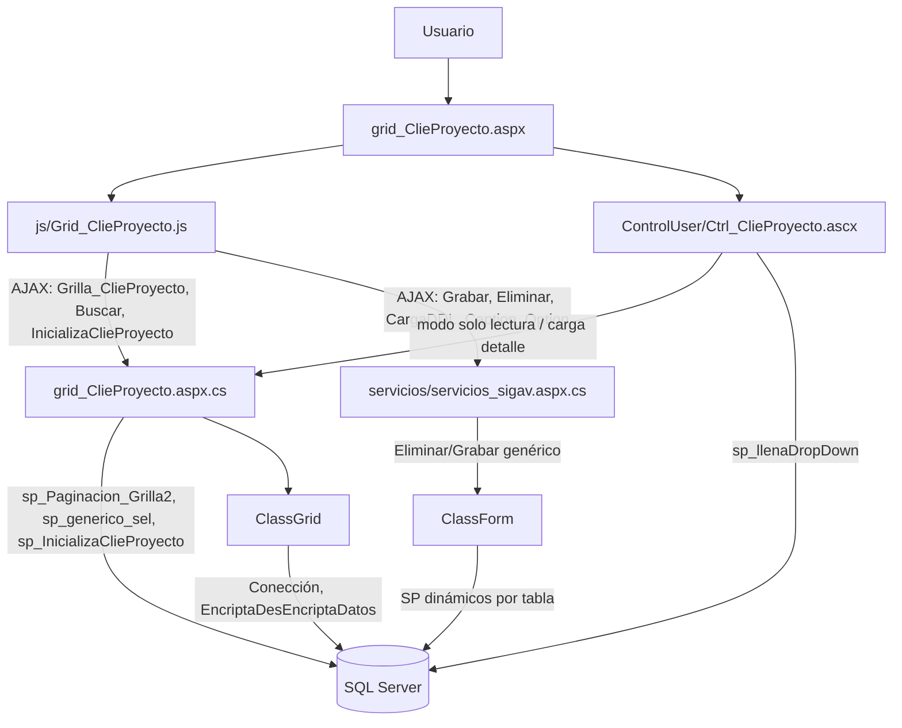
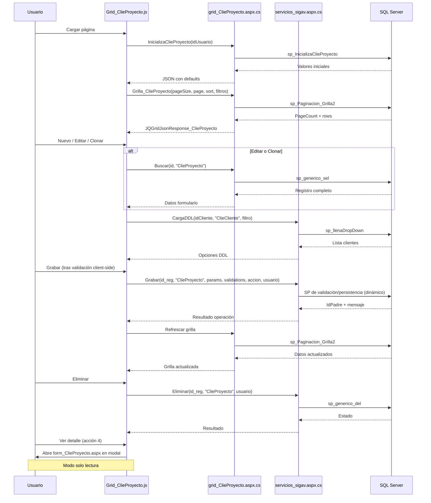

# Análisis de `grid_ClieProyecto.aspx`

## 1) Descripción y función

`grid_ClieProyecto.aspx` es el componente de mantenimiento de **Proyectos de Clientes** en la capa WebForms.

Su función principal es implementar el flujo CRUD sobre la entidad `ClieProyecto` mediante:

- una **grilla jqGrid** para búsqueda, paginación y acciones por fila,
- un **formulario modal** (`Ctrl_ClieProyecto.ascx`) para alta/edición/clonación,
- servicios AJAX (`WebMethod`) en `grid_ClieProyecto.aspx.cs` y `servicios/servicios_sigav.aspx.cs`.

Los proyectos están asociados a clientes específicos y contienen información sobre nombre, año, centro de costo y empresa.

---

## 2) Artefactos involucrados

### Página y control

- `grid_ClieProyecto.aspx`
- `grid_ClieProyecto.aspx.cs` (la directiva del ASPX apunta a `grId_ClieProyecto.aspx.cs`)
- `ControlUser/Ctrl_ClieProyecto.ascx`
- `ControlUser/Ctrl_ClieProyecto.ascx.cs`
- `form_ClieProyecto.aspx` (vista de detalle en solo lectura)

### JavaScript principal

- `js/Grid_ClieProyecto.js`

### Servicios comunes

- `servicios/servicios_sigav.aspx.cs`

---

## 3) Dependencias JS (objetos y funciones)

### Grilla (`js/Grid_ClieProyecto.js`)

- `Grilla_ClieProyecto(filtro, NombreCol, OrdenCol, filas)`:
  - inicializa jqGrid con 5 columnas: IdClieProyecto, Nombre, Año, Centro Costo, Empresa,
  - llama por AJAX a `Grid_ClieProyecto.aspx/Grilla_ClieProyecto`,
  - aplica filtros dinámicos (hasta 3 filtros simultáneos),
  - construye botones de exportación (`Excel`, `CSV`),
  - calcula altura y ancho responsivos basados en ventana.

- `Accion_ClieProyecto(id, accion, idpadre, usuario)`:
  - `0`: Nuevo → `popform_ClieProyecto`
  - `1`: Editar → `popform_ClieProyecto`
  - `2`: Clonar → `popform_ClieProyecto`
  - `3`: Eliminar → `eliminareg`
  - `4`: Ver detalle → `SubFormJquery` con `form_ClieProyecto.aspx`

- `Caption(ifilter1, iColumn1, ifilter2, iColumn2, ifilter3, iColumn3, iTabla, filas, NombreCol, OrdenCol)`:
  - genera UI de la barra de herramientas con filtros y botones (Buscar, Limpiar, Nuevo, Cerrar).

- `Filtros(ifilter, iColumn, iTabla, NroFiltro)`:
  - genera combos de filtro dinámicos,
  - usa `servicios_sigav.aspx/Caption_Option`.

### Formulario modal (`Ctrl_ClieProyecto.ascx`)

- `popform_ClieProyecto(id, tabla, id_Origen, accion, titulo, hijo, pagina, idpadre, idProceso, TablaOrigen)`:
  - abre modal jQuery UI (750x550 px),
  - orquesta flujo CRUD (Grabar, Eliminar, Cerrar),
  - registra eventos de log (apertura/cierre),
  - habilita/deshabilita botones según acción.

- `BuscarDatos_ClieProyecto(id, tabla, accion, hijo, idpadre, TablaOrigen, id_Origen)`:
  - carga datos para edición/clonado (`grid_ClieProyecto.aspx/Buscar`),
  - llena el formulario con valores existentes,
  - carga DDL de Cliente mediante `DDLIdClieCliente`.

- `Grabar_ClieProyecto(id, tabla, accion, hijo, usuario, idProceso, CallBack)`:
  - persiste cambios (`servicios_sigav.aspx/Grabar`),
  - recibe parámetros de grabación y validación,
  - recarga grilla al terminar exitosamente.

- `CambiosClieProyecto()`:
  - detecta modificaciones en el formulario,
  - habilita botón Grabar cuando hay cambios.

- **Funciones de parámetros**:
  - `ParametrosGrabar_ClieProyecto()`: genera string de parámetros para inserción/actualización.
  - `ParametrosValidacion_ClieProyecto()`: parámetros para validaciones de backend.
  - `ParamValObligatorios_ClieProyecto()`: campos obligatorios (IdClieCliente, Nombre).

- `DatosValidacion_ClieProyecto()`:
  - validación client-side mediante expresiones regulares,
  - valida: IdClieProyecto (numérico), IdClieCliente (numérico), Nombre (alfanumérico con símbolos), CentroCosto, Empresa, Annio.

- `DDLIdClieCliente(id, tabla, filtro, id_selected, accion)`:
  - carga dinámicamente dropdown de clientes,
  - usa `servicios_sigav.aspx/CargaDDL`.

- `LimpiaDatos_ClieProyecto(accion)`:
  - limpia todos los campos del formulario,
  - deshabilita IdClieProyecto (autogenerado).

- `PopIdClieCliente_ClieProyecto()`:
  - abre ventana de búsqueda de clientes (`Buscar_ClieCliente.aspx`).

- `BuscaCbx_IdClieCliente()`:
  - callback para actualizar el combobox de cliente tras búsqueda.

---

## 4) Dependencias C# (métodos y clases)

### `grid_ClieProyecto.aspx.cs` (grId_ClieProyecto.aspx.cs)

- **`Page_Load`**:
  - valida autenticación (`HttpContext.Current.User.Identity.IsAuthenticated`),
  - controla perfil (`Autentificacion.ValidaPerfil` con tabla "ClieProyecto"),
  - registra acceso (`ClassSigav.GrabaLogAccesos`),
  - soporta apertura directa en modo edición por parámetro `IdRegistro` (encriptado con `ClassGrid.EncriptaDesEncriptaDatos`).

- **WebMethods**:
  - `InicializaClieProyecto(string idUsuario)`:
    - obtiene valores iniciales mediante `sp_InicializaClieProyecto`,
    - retorna lista con `IdClieCliente`, `Nombre`, `CentroCosto`, `Empresa`, `Annio`.
  
  - `Buscar(string id_reg, string tabla)`:
    - búsqueda de registro por ID usando `sp_generico_sel`,
    - retorna entidad `ClieProyecto` poblada.
  
  - `Grilla_ClieProyecto(int pPageSize, int pCurrentPage, string pSortColumn, string pSortOrder, string tabla, string pSearchField, string pSearchString)`:
    - ejecuta `sp_Paginacion_Grilla2` con filtros dinámicos,
    - construye botones de acción (Editar, Clonar, Eliminar, Ver) por fila,
    - retorna JSON compatible con jqGrid (`JQGridJsonResponse_ClieProyecto`).

- **Clases**:
  - `ClieProyecto`: DTO con propiedades `ws_IdClieProyecto`, `ws_IdClieCliente`, `ws_Nombre`, `ws_CentroCosto`, `ws_Empresa`, `ws_Annio`, `ws_Botones`.
    - método `Encontrar()`: wrapper para `sp_generico_sel`.
  
  - `BtnClieProyecto`: mensajes de respuesta (`ws_IdMensaje`, `ws_Descripcion`).
  
  - `JQGridJsonResponse_ClieProyecto`: respuesta paginada para jqGrid (`PageCount`, `CurrentPage`, `RecordCount`, `Items`).

### `ControlUser/Ctrl_ClieProyecto.ascx.cs`

- **`Page_Load`**:
  - si se recibe `tabla=ClieProyecto` en QueryString, ejecuta `Inicio()` para modo solo lectura.

- **`Inicio()`**:
  - obtiene ID de QueryString,
  - llama a `BuscaClieProyecto()`,
  - aplica `SoloLectura()`.

- **`BuscaClieProyecto(string IdClieProyecto)`**:
  - ejecuta `sp_generico_sel` para obtener datos del proyecto,
  - llena controles del formulario.

- **`DLLIdClieCliente(string filtro)`**:
  - llena dropdown de clientes usando `sp_llenaDropDown`.

- **`SoloLectura()`**:
  - deshabilita todos los controles del formulario,
  - oculta botones de acción (para vista de detalle).

### `servicios/servicios_sigav.aspx.cs`

- **`Grabar(...)`**:
  - método genérico de persistencia,
  - delega validación y persistencia a `ClassForm.Validacion(...)`,
  - determina dinámicamente el SP de inserción/actualización según tabla.

- **`Eliminar(...)`**:
  - eliminación genérica vía `ClassForm.Eliminacion(...)`,
  - usa `sp_generico_del`.

- **`CargaDDL(...)`**:
  - carga dinámica de dropdowns/combobox,
  - retorna pares Value/Text.

- **`Caption_Option(...)`**:
  - genera opciones para filtros dinámicos de grilla.

---

## 5) Procedimientos almacenados de servidor

### Directos desde el componente

- **`sp_InicializaClieProyecto`**:
  - parámetro: `@idUsuario`,
  - retorna valores iniciales para nuevo proyecto (probablemente valores por defecto o último registro).

- **`sp_generico_sel`**:
  - parámetros: `@tabla` ('ClieProyecto'), `@id_reg`,
  - búsqueda genérica por ID,
  - retorna todas las columnas del registro.

- **`sp_Paginacion_Grilla2`**:
  - parámetros: `@PageSize`, `@CurrentPage`, `@SortColumn`, `@SortOrder`, `@tabla` ('ClieProyecto'), `@filtro`, `@IdUsuario`,
  - retorna dos tablas:
    - [0]: `PageCount`, `CurrentPage`, `RecordCount`,
    - [1]: filas paginadas con columnas del proyecto.

### Indirectos/generales usados en el flujo

- **`sp_generico_del`**:
  - eliminación genérica (vía `servicios_sigav.aspx/Eliminar`),
  - parámetros: tabla, ID, usuario.

- **`sp_llenaDropDown`**:
  - carga de combos (vía `Ctrl_ClieProyecto.ascx.cs`),
  - parámetros: columnas, tabla con filtro, orden.

- **Procedimientos de inserción/actualización**:
  - invocados desde `ClassForm.Validacion(...)` en `servicios_sigav.aspx/Grabar`,
  - resolución dinámica por tabla/reglas de negocio,
  - probablemente: `sp_ClieProyecto_ins` o `sp_ClieProyecto_upd` (patrón común en el sistema).

---

## 6) Flujo CRUD e interacciones

### Create (Nuevo)

1. Usuario pulsa **Nuevo** en grilla.
2. `Accion_ClieProyecto(..., accion=0)` abre `popform_ClieProyecto`.
3. Se ejecuta `LimpiaDatos_ClieProyecto(0)` para limpiar formulario.
4. Se inicializan combos/valores mediante `InicializaClieProyecto` y `DDLIdClieCliente`.
5. Usuario selecciona cliente e ingresa: Nombre, Año, Centro Costo, Empresa.
6. `CambiosClieProyecto()` detecta modificaciones y habilita botón Grabar.
7. Usuario pulsa **Grabar**:
   - se ejecuta validación client-side (`DatosValidacion_ClieProyecto`),
   - si válido, llama `Grabar_ClieProyecto` → `servicios_sigav.aspx/Grabar`.
8. Backend persiste (vía `ClassForm.Validacion`) y devuelve `IdPadre`/mensaje.
9. Se recarga grilla (`Grilla_ClieProyecto(1)`).
10. Modal se cierra y muestra mensaje de éxito.

### Read (Listar / Ver)

- **Listar**:
  - `Grilla_ClieProyecto` (JS) llama a `Grilla_ClieProyecto` (WebMethod),
  - ejecuta `sp_Paginacion_Grilla2` con filtros aplicados,
  - renderiza jqGrid con paginación y ordenamiento.

- **Ver detalle**:
  - acción 4 abre `form_ClieProyecto.aspx` en modal (`SubFormJquery`),
  - `Ctrl_ClieProyecto.ascx.cs` carga registro con `sp_generico_sel`,
  - aplica `SoloLectura()` para deshabilitar edición.

### Update (Editar)

1. Usuario pulsa **Editar** en fila de grilla.
2. `Accion_ClieProyecto(..., accion=1)` abre modal.
3. `BuscarDatos_ClieProyecto` obtiene datos con `sp_generico_sel`.
4. Formulario se llena con valores existentes.
5. Usuario modifica campos (Nombre, Año, etc.).
6. `CambiosClieProyecto()` detecta cambios y habilita Grabar.
7. Validaciones client-side (`DatosValidacion_ClieProyecto`).
8. `Grabar_ClieProyecto` con `accion=1` persiste cambios.
9. Se recarga grilla y cierra modal.

### Delete (Eliminar)

1. Usuario pulsa **Eliminar** en fila.
2. `eliminareg` muestra diálogo de confirmación jQuery UI.
3. Si confirma, llama `servicios_sigav.aspx/Eliminar`.
4. Backend ejecuta `sp_generico_del` para marcar como eliminado.
5. UI muestra mensaje y refresca grilla.

### Clone (Clonar)

1. Usuario pulsa **Clonar** en fila.
2. `Accion_ClieProyecto(..., accion=2)` abre modal.
3. Se cargan datos del registro original.
4. Usuario modifica lo necesario.
5. Al grabar, se persiste como nuevo registro (lógica manejada por backend según parámetro `accion`).

---

## 7) Diagrama de objetos (Mermaid)

---

## 8) Diagrama de proceso CRUD (Mermaid)

---

## 9) Relaciones de datos

`ClieProyecto` depende de `ClieCliente` mediante clave foránea.

Para información detallada sobre esta y otras relaciones del sistema, consultar:  
📘 **[Relaciones entre Entidades - Sistema SIGAV](../../Relaciones_Entidades.md#clieproyecto-a-cliecliente)**

---

## 10) Características especiales

### Filtros dinámicos
- Soporte para **3 filtros simultáneos** con operador `LIKE`,
- Columnas filtrables generadas dinámicamente vía `Caption_Option`,
- Filtros persistentes entre recargas (mediante cookies o `GrillaFiltroInicial`).

### Responsividad
- Ancho de columnas calculado como porcentajes de ventana: `$(window).width() - 50`,
- Alto de grilla adaptativo: `$(window).height() - 200`,
- Filas por página calculadas dinámicamente: `parseInt(($(window).height() - 200) / 23)`.

### Seguridad
- Validación de perfil por usuario (`Autentificacion.ValidaPerfil`),
- Log de accesos y eventos (`ClassSigav.GrabaLogAccesos`, `Registrar_LogEvento`),
- Parámetros encriptados en URLs (`ClassGrid.EncriptaDesEncriptaDatos`).

### Exportación
- Botones para exportar a **Excel** (`.xls`) y **CSV** (`.csv`),
- Función `ExportGrilla` con delimitadores configurables.

### Auditoría
- Registro de apertura/cierre de formulario,
- Usuario y timestamp en todas las operaciones CRUD.

---

## 11) Resumen

`grid_ClieProyecto.aspx` implementa un CRUD WebForms estándar para la gestión de proyectos de clientes, con:

- **jqGrid** con paginación, ordenamiento y filtros múltiples,
- **Modal jQuery UI** para edición con validaciones regex,
- **Servicios genéricos** de persistencia y eliminación,
- **SPs parametrizados** para consulta y manipulación de datos,
- **Relación fuerte** con `ClieCliente` mediante clave foránea,
- **Exportación** a formatos estándar,
- **Seguridad** basada en perfiles y auditoría completa.

Es un componente simple pero completo, con menos complejidad que `grid_ClieCliente` (sin validaciones especiales tipo RUT ni sincronizaciones externas), enfocado en la gestión básica de información de proyectos asociados a clientes.
