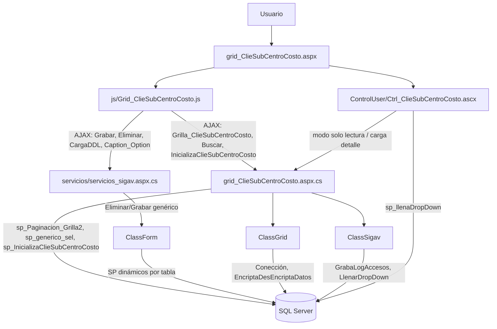
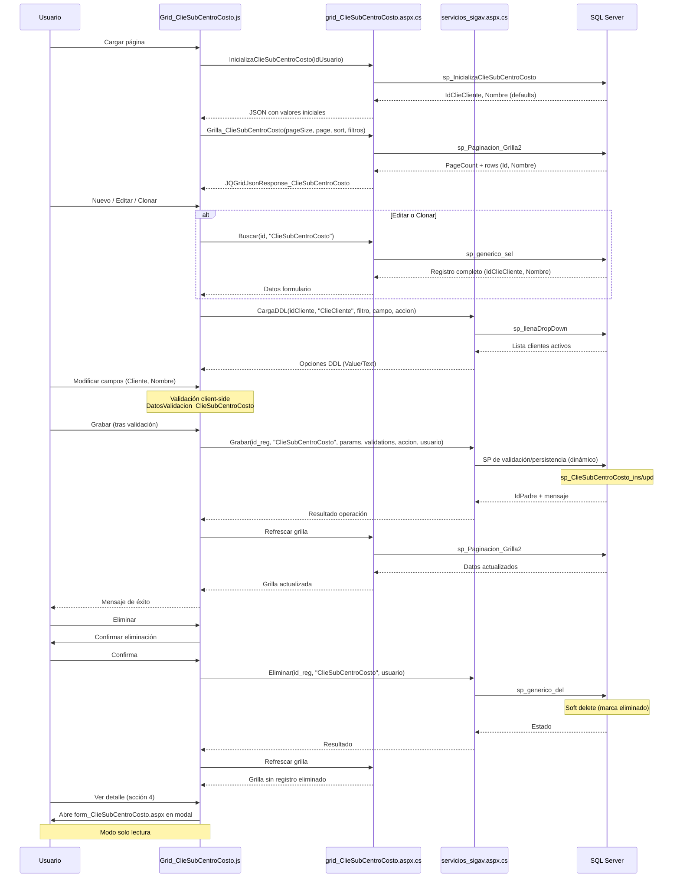

# Análisis de `grid_ClieSubCentroCosto.aspx`

## 1) Descripción y función

`grid_ClieSubCentroCosto.aspx` es el componente de mantenimiento de **Sub Centros de Costos de Clientes** en la capa WebForms.

Su función principal es implementar el flujo CRUD sobre la entidad `ClieSubCentroCosto` mediante:

- una **grilla jqGrid** para búsqueda, paginación y acciones por fila,
- un **formulario modal** (`Ctrl_ClieSubCentroCosto.ascx`) para alta/edición/clonación,
- servicios AJAX (`WebMethod`) en `grid_ClieSubCentroCosto.aspx.cs` y `servicios/servicios_sigav.aspx.cs`.

Los sub centros de costo están asociados a clientes específicos y permiten una subdivisión más granular de los centros de costo para propósitos de seguimiento y control presupuestario.

---

## 2) Artefactos involucrados

### Página y control

- `grid_ClieSubCentroCosto.aspx`
- `grid_ClieSubCentroCosto.aspx.cs` (la directiva del ASPX apunta a `grId_ClieSubCentroCosto.aspx.cs`)
- `ControlUser/Ctrl_ClieSubCentroCosto.ascx`
- `ControlUser/Ctrl_ClieSubCentroCosto.ascx.cs`
- `form_ClieSubCentroCosto.aspx` (vista de detalle en solo lectura)

### JavaScript principal

- `js/Grid_ClieSubCentroCosto.js`

### Servicios comunes

- `servicios/servicios_sigav.aspx.cs`

---

## 3) Dependencias JS (objetos y funciones)

### Grilla (`js/Grid_ClieSubCentroCosto.js`)

- `Grilla_ClieSubCentroCosto(filtro, NombreCol, OrdenCol, filas)`:
  - inicializa jqGrid con 2 columnas: IdClieSubCentroCosto, Nombre (diseño simplificado),
  - llama por AJAX a `Grid_ClieSubCentroCosto.aspx/Grilla_ClieSubCentroCosto`,
  - aplica filtros dinámicos (hasta 3 filtros simultáneos),
  - construye botones de exportación (`Excel`, `CSV`),
  - calcula altura y ancho responsivos basados en ventana,
  - orden por defecto: `IdClieSubCentroCosto DESC`.

- `Accion_ClieSubCentroCosto(id, accion, idpadre, usuario)`:
  - `0`: Nuevo → `popform_ClieSubCentroCosto`
  - `1`: Editar → `popform_ClieSubCentroCosto`
  - `2`: Clonar → `popform_ClieSubCentroCosto`
  - `3`: Eliminar → `eliminareg`
  - `4`: Ver detalle → `SubFormJquery` con `form_ClieSubCentroCosto.aspx`

- `Caption(ifilter1, iColumn1, ifilter2, iColumn2, ifilter3, iColumn3, iTabla, filas, NombreCol, OrdenCol)`:
  - genera UI de la barra de herramientas con filtros y botones (Buscar, Limpiar, Nuevo, Cerrar).

- `Filtros(ifilter, iColumn, iTabla, NroFiltro)`:
  - genera combos de filtro dinámicos,
  - usa `servicios_sigav.aspx/Caption_Option`.

### Formulario modal (`Ctrl_ClieSubCentroCosto.ascx`)

- `popform_ClieSubCentroCosto(id, tabla, id_Origen, accion, titulo, hijo, pagina, idpadre, idProceso, TablaOrigen)`:
  - abre modal jQuery UI (750x550 px),
  - orquesta flujo CRUD (Grabar, Eliminar, Cerrar),
  - registra eventos de log (apertura/cierre),
  - habilita/deshabilita botones según acción.

- `BuscarDatos_ClieSubCentroCosto(id, tabla, accion, hijo, idpadre, TablaOrigen, id_Origen)`:
  - carga datos para edición/clonado (`grid_ClieSubCentroCosto.aspx/Buscar`),
  - llena el formulario con valores existentes,
  - carga DDL de Cliente mediante `DDLIdClieCliente`.

- `Grabar_ClieSubCentroCosto(id, tabla, accion, hijo, usuario, idProceso, CallBack)`:
  - persiste cambios (`servicios_sigav.aspx/Grabar`),
  - recibe parámetros de grabación y validación,
  - recarga grilla al terminar exitosamente.

- `CambiosClieSubCentroCosto()`:
  - detecta modificaciones en el formulario,
  - habilita botón Grabar cuando hay cambios,
  - monitorea cambios en combobox de Cliente.

- **Funciones de parámetros**:
  - `ParametrosGrabar_ClieSubCentroCosto()`: genera string con IdClieCliente y Nombre.
  - `ParametrosValidacion_ClieSubCentroCosto()`: parámetros para validaciones de backend (IdClieSubCentroCosto, Nombre).
  - `ParamValObligatorios_ClieSubCentroCosto()`: campos obligatorios (IdClieCliente, Nombre).

- `DatosValidacion_ClieSubCentroCosto()`:
  - validación client-side mediante expresiones regulares,
  - valida:
    - IdClieSubCentroCosto (numérico, 0-10 dígitos),
    - IdClieCliente (numérico, 0-10 dígitos),
    - Nombre (alfanumérico con símbolos especiales, max 50 caracteres).

- `DDLIdClieCliente(id, tabla, filtro, id_selected, accion)`:
  - carga dinámicamente dropdown de clientes,
  - usa `servicios_sigav.aspx/CargaDDL`.

- `LimpiaDatos_ClieSubCentroCosto(accion)`:
  - limpia todos los campos del formulario,
  - deshabilita IdClieSubCentroCosto (autogenerado).

- `PopIdClieCliente_ClieSubCentroCosto()`:
  - abre ventana de búsqueda de clientes (`Buscar_ClieCliente.aspx`).

- `BuscaCbx_IdClieCliente()`:
  - callback para actualizar el combobox de cliente tras búsqueda.

---

## 4) Dependencias C# (métodos y clases)

### `grid_ClieSubCentroCosto.aspx.cs` (grId_ClieSubCentroCosto.aspx.cs)

- **`Page_Load`**:
  - valida autenticación (`HttpContext.Current.User.Identity.IsAuthenticated`),
  - controla perfil (`Autentificacion.ValidaPerfil` con tabla "ClieSubCentroCosto"),
  - registra acceso (`ClassSigav.GrabaLogAccesos`),
  - soporta apertura directa en modo edición por parámetro `IdRegistro` (encriptado con `ClassGrid.EncriptaDesEncriptaDatos`).

- **WebMethods**:
  - `InicializaClieSubCentroCosto(string idUsuario)`:
    - obtiene valores iniciales mediante `sp_InicializaClieSubCentroCosto`,
    - retorna lista con `IdClieCliente` y `Nombre`.
  
  - `Buscar(string id_reg, string tabla)`:
    - búsqueda de registro por ID usando `sp_generico_sel`,
    - retorna entidad `ClieSubCentroCosto` poblada.
  
  - `Grilla_ClieSubCentroCosto(int pPageSize, int pCurrentPage, string pSortColumn, string pSortOrder, string tabla, string pSearchField, string pSearchString)`:
    - ejecuta `sp_Paginacion_Grilla2` con filtros dinámicos,
    - construye botones de acción (Editar, Clonar, Eliminar, Ver) por fila,
    - retorna JSON compatible con jqGrid (`JQGridJsonResponse_ClieSubCentroCosto`).

- **Clases**:
  - `ClieSubCentroCosto`: DTO con propiedades:
    - `ws_IdClieSubCentroCosto` (Int32),
    - `ws_IdClieCliente` (string),
    - `ws_Nombre` (string),
    - `ws_Botones` (string, HTML de botones).
    - método `Encontrar()`: wrapper para `sp_generico_sel`.
  
  - `BtnClieSubCentroCosto`: mensajes de respuesta (`ws_IdMensaje`, `ws_Descripcion`).
  
  - `JQGridJsonResponse_ClieSubCentroCosto`: respuesta paginada para jqGrid (`PageCount`, `CurrentPage`, `RecordCount`, `Items`).

### `ControlUser/Ctrl_ClieSubCentroCosto.ascx.cs`

- **`Page_Load`**:
  - si se recibe `tabla=ClieSubCentroCosto` en QueryString, ejecuta `Inicio()` para modo solo lectura.

- **`Inicio()`**:
  - obtiene ID de QueryString,
  - llama a `BuscaClieSubCentroCosto()`,
  - aplica `SoloLectura()`.

- **`BuscaClieSubCentroCosto(string IdClieSubCentroCosto)`**:
  - ejecuta `sp_generico_sel` para obtener datos del sub centro de costo,
  - llena controles del formulario (IdClieCliente, Nombre).

- **`DLLIdClieCliente(string filtro)`**:
  - llena dropdown de clientes usando `sp_llenaDropDown`,
  - construye query dinámica con filtro SQL.

- **`SoloLectura()`**:
  - deshabilita todos los controles del formulario,
  - oculta botón de búsqueda de cliente (PopIdClieCliente),
  - deshabilita combobox de cliente.

### `servicios/servicios_sigav.aspx.cs`

- **`Grabar(...)`**:
  - método genérico de persistencia,
  - delega validación y persistencia a `ClassForm.Validacion(...)`,
  - determina dinámicamente el SP de inserción/actualización según tabla.

- **`Eliminar(...)`**:
  - eliminación genérica vía `ClassForm.Eliminacion(...)`,
  - usa `sp_generico_del`.

- **`CargaDDL(...)`**:
  - carga dinámica de dropdowns/combobox,
  - retorna pares Value/Text.

- **`Caption_Option(...)`**:
  - genera opciones para filtros dinámicos de grilla.

---

## 5) Procedimientos almacenados de servidor

### Directos desde el componente

- **`sp_InicializaClieSubCentroCosto`**:
  - parámetro: `@idUsuario`,
  - retorna valores iniciales para nuevo sub centro de costo:
    - `IdClieCliente` (probablemente último cliente usado o default),
    - `Nombre` (vacío o template).

- **`sp_generico_sel`**:
  - parámetros: `@tabla` ('ClieSubCentroCosto'), `@id_reg`,
  - búsqueda genérica por ID,
  - retorna todas las columnas del registro:
    - `IdClieSubCentroCosto`,
    - `IdClieCliente`,
    - `Nombre`.

- **`sp_Paginacion_Grilla2`**:
  - parámetros: `@PageSize`, `@CurrentPage`, `@SortColumn`, `@SortOrder`, `@tabla` ('ClieSubCentroCosto'), `@filtro`, `@IdUsuario`,
  - retorna dos tablas:
    - [0]: `PageCount`, `CurrentPage`, `RecordCount`,
    - [1]: filas paginadas con columnas del sub centro de costo.

### Indirectos/generales usados en el flujo

- **`sp_generico_del`**:
  - eliminación genérica (vía `servicios_sigav.aspx/Eliminar`),
  - parámetros: tabla, ID, usuario,
  - marca registro como eliminado (soft delete).

- **`sp_llenaDropDown`**:
  - carga de combos (vía `Ctrl_ClieSubCentroCosto.ascx.cs`),
  - parámetros: columnas ('IdClieCliente,Nombre'), tabla con filtro ('ClieCliente where...'), orden ('Nombre2').

- **Procedimientos de inserción/actualización**:
  - invocados desde `ClassForm.Validacion(...)` en `servicios_sigav.aspx/Grabar`,
  - resolución dinámica por tabla/reglas de negocio,
  - probablemente: `sp_ClieSubCentroCosto_ins` o `sp_ClieSubCentroCosto_upd` (patrón común en el sistema).

---

## 6) Flujo CRUD e interacciones

### Create (Nuevo)

1. Usuario pulsa **Nuevo** en grilla.
2. `Accion_ClieSubCentroCosto(..., accion=0)` abre `popform_ClieSubCentroCosto`.
3. Se ejecuta `LimpiaDatos_ClieSubCentroCosto(0)` para limpiar formulario.
4. Se inicializan combos/valores mediante `InicializaClieSubCentroCosto` y `DDLIdClieCliente`.
5. Usuario selecciona cliente e ingresa nombre del sub centro de costo.
6. `CambiosClieSubCentroCosto()` detecta modificaciones y habilita botón Grabar.
7. Usuario pulsa **Grabar**:
   - se ejecuta validación client-side (`DatosValidacion_ClieSubCentroCosto`),
   - verifica obligatoriedad de IdClieCliente y Nombre,
   - si válido, llama `Grabar_ClieSubCentroCosto` → `servicios_sigav.aspx/Grabar`.
8. Backend ejecuta validaciones y persiste (vía `ClassForm.Validacion`).
9. Retorna `IdPadre` (nuevo ID generado) y mensaje de éxito.
10. Se recarga grilla (`Grilla_ClieSubCentroCosto(1)`).
11. Modal se cierra y muestra mensaje de confirmación.

### Read (Listar / Ver)

- **Listar**:
  - `Grilla_ClieSubCentroCosto` (JS) llama a `Grilla_ClieSubCentroCosto` (WebMethod),
  - ejecuta `sp_Paginacion_Grilla2` con filtros aplicados,
  - renderiza jqGrid con paginación y ordenamiento,
  - columnas visibles: Id (10%), Nombre (75%), Botones (180px).

- **Ver detalle**:
  - acción 4 abre `form_ClieSubCentroCosto.aspx` en modal (`SubFormJquery`),
  - `Ctrl_ClieSubCentroCosto.ascx.cs` carga registro con `sp_generico_sel`,
  - aplica `SoloLectura()` para deshabilitar edición y visualización.

### Update (Editar)

1. Usuario pulsa **Editar** en fila de grilla.
2. `Accion_ClieSubCentroCosto(..., accion=1)` abre modal con título "Edición del ClieSubCentroCosto".
3. `BuscarDatos_ClieSubCentroCosto` obtiene datos con `sp_generico_sel`.
4. Formulario se llena con valores existentes:
   - IdClieSubCentroCosto (deshabilitado),
   - IdClieCliente (combobox con valor preseleccionado),
   - Nombre.
5. Usuario modifica campos permitidos (cliente y/o nombre).
6. `CambiosClieSubCentroCosto()` detecta cambios y habilita Grabar.
7. Validaciones client-side (`DatosValidacion_ClieSubCentroCosto`).
8. `Grabar_ClieSubCentroCosto` con `accion=1` persiste cambios.
9. Backend actualiza registro existente.
10. Se recarga grilla y cierra modal.

### Delete (Eliminar)

1. Usuario pulsa **Eliminar** en fila.
2. `eliminareg` muestra diálogo de confirmación jQuery UI:
   - "Está a punto de eliminar un registro?"
3. Si confirma, llama `servicios_sigav.aspx/Eliminar`.
4. Backend ejecuta `sp_generico_del` para marcar como eliminado.
5. UI muestra mensaje de resultado.
6. Grilla se refresca automáticamente para ocultar registro eliminado.

### Clone (Clonar)

1. Usuario pulsa **Clonar** en fila.
2. `Accion_ClieSubCentroCosto(..., accion=2)` abre modal con título "Clonación del ClieSubCentroCosto".
3. Se cargan datos del registro original.
4. Usuario puede modificar cliente y/o nombre.
5. Al grabar, se persiste como nuevo registro (lógica manejada por backend según parámetro `accion`).
6. Se genera nuevo IdClieSubCentroCosto.

---

## 7) Diagrama de objetos (Mermaid)

---

## 8) Diagrama de proceso CRUD (Mermaid)

---

## 9) Relaciones de datos

`ClieSubCentroCosto` depende de `ClieCliente` mediante clave foránea.

Para información detallada sobre esta y otras relaciones del sistema, consultar:  
📘 **[Relaciones entre Entidades - Sistema SIGAV](../../Relaciones_Entidades.md#cliesubcentrocosto-a-cliecliente)**

---

## 10) Características especiales

### Diseño simplificado
- **Solo 2 columnas visibles**: Id (10%) y Nombre (75%),
- Enfoque en simplicidad y facilidad de uso,
- Campos mínimos requeridos: Cliente + Nombre.

### Filtros dinámicos
- Soporte para **3 filtros simultáneos** con operador `LIKE`,
- Columnas filtrables generadas dinámicamente vía `Caption_Option`,
- Filtros persistentes entre recargas (mediante cookies o `GrillaFiltroInicial`).

### Responsividad
- Ancho de columnas calculado como porcentajes de ventana: `$(window).width() - 50`,
- Alto de grilla adaptativo: `$(window).height() - 200`,
- Filas por página calculadas dinámicamente: `parseInt(($(window).height() - 200) / 23)`.

### Seguridad
- Validación de perfil por usuario (`Autentificacion.ValidaPerfil`),
- Log de accesos y eventos (`ClassSigav.GrabaLogAccesos`, `Registrar_LogEvento`),
- Parámetros encriptados en URLs (`ClassGrid.EncriptaDesEncriptaDatos`).

### Exportación
- Botones para exportar a **Excel** (`.xls`, delimitador `\t`) y **CSV** (`.csv`, delimitador `;`),
- Función `ExportGrilla` con configuración personalizable.

### Auditoría
- Registro de apertura/cierre de formulario (eventos 4 y 5),
- Usuario y timestamp en todas las operaciones CRUD,
- Trazabilidad completa de accesos y modificaciones.

### Validaciones
- **Client-side**: expresiones regulares para cada campo,
- **Server-side**: validaciones de negocio en procedimientos almacenados,
- **Obligatoriedad**: Cliente y Nombre son campos requeridos.

---

## 11) Estructura de datos

### Tabla ClieSubCentroCosto (inferida)

| Campo | Tipo | Null | Descripción |
|-------|------|------|-------------|
| IdClieSubCentroCosto | int | No | PK, Identity |
| IdClieCliente | int | No | FK a ClieCliente |
| Nombre | varchar(50) | No | Nombre del sub centro de costo |
| FechaCreacion | datetime | Sí | Timestamp de creación |
| UsuarioCreacion | varchar(50) | Sí | Usuario que creó el registro |
| FechaModificacion | datetime | Sí | Timestamp de última modificación |
| UsuarioModificacion | varchar(50) | Sí | Usuario que modificó el registro |
| Eliminado | bit | Sí | Flag de soft delete |

### Índices (sugeridos)
- PK en `IdClieSubCentroCosto`
- FK en `IdClieCliente`
- Index en `Nombre` para búsquedas
- Index filtrado en `Eliminado = 0` para consultas activas

---

## 12) Resumen

`grid_ClieSubCentroCosto.aspx` implementa un CRUD WebForms simplificado y eficiente para la gestión de sub centros de costo de clientes, con:

- **jqGrid** con paginación, ordenamiento y filtros múltiples (diseño minimalista de 2 columnas),
- **Modal jQuery UI** para edición con validaciones regex y campos obligatorios,
- **Servicios genéricos** de persistencia y eliminación,
- **SPs parametrizados** para consulta y manipulación de datos,
- **Relación fuerte** con `ClieCliente` mediante clave foránea obligatoria,
- **Exportación** a Excel y CSV,
- **Seguridad** basada en perfiles y auditoría completa,
- **Diseño responsivo** adaptado a tamaño de ventana.

Es un componente **maestro simple** ideal para mantener catálogos de subdivisiones presupuestarias, con bajo acoplamiento y alta reutilización del framework genérico de la aplicación. Su simplicidad (solo 2 campos de usuario: Cliente + Nombre) lo hace fácil de mantener y usar.

### Casos de uso principales

1. **Gestión de estructura presupuestaria**: crear y mantener subdivisiones de centros de costo por cliente.
2. **Búsqueda y consulta**: filtrar y exportar catálogos de sub centros de costo.
3. **Trazabilidad**: auditar creaciones, modificaciones y eliminaciones.
4. **Integración**: servir como entidad relacionada en módulos de facturación, proyectos o control presupuestario.
