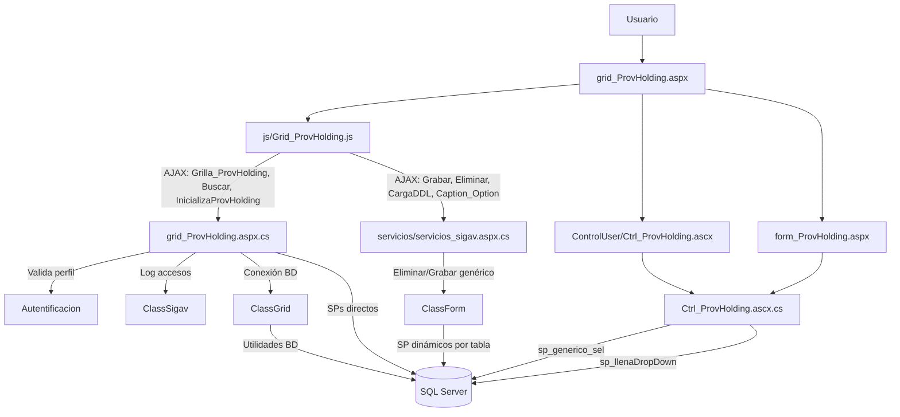
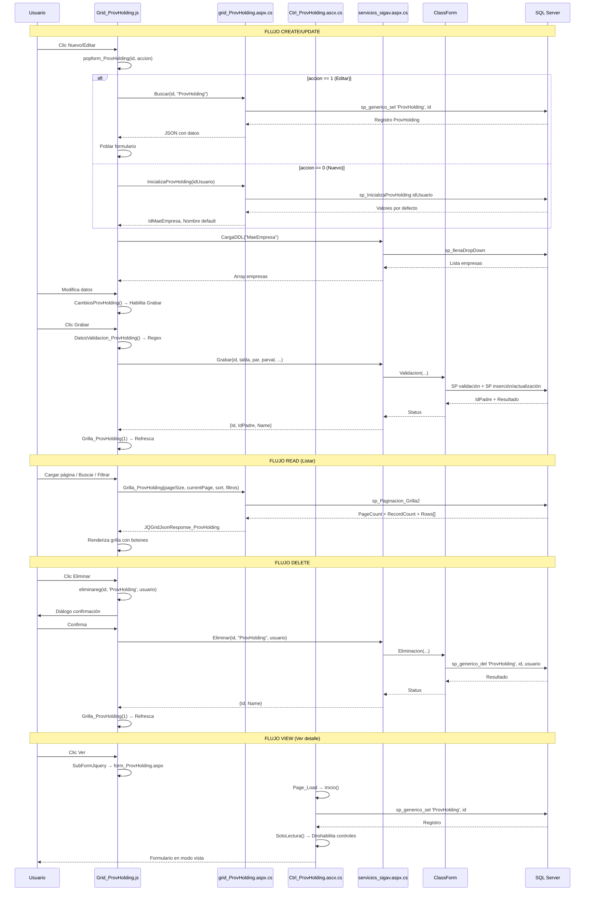

# Análisis de `grid_ProvHolding.aspx`

## 1) Descripción y función

`grid_ProvHolding.aspx` es el componente de mantenimiento de **Holdings de Proveedores** en la capa WebForms del módulo de maestros de proveedores.

Su función principal es implementar el flujo CRUD sobre la entidad `ProvHolding` mediante:

- una **grilla jqGrid** para búsqueda, paginación y acciones por fila,
- un **formulario modal** (`Ctrl_ProvHolding.ascx`) para alta/edición/clonación,
- servicios AJAX (`WebMethod`) en `grid_ProvHolding.aspx.cs` y `servicios/servicios_sigav.aspx.cs`.

Un **holding de proveedores** representa un grupo empresarial que agrupa múltiples proveedores pertenecientes a la misma organización o conglomerado, permitiendo la gestión consolidada de relaciones comerciales con grupos empresariales.

---

## 2) Artefactos involucrados

### Página y control

- `grid_ProvHolding.aspx`
- `grid_ProvHolding.aspx.cs` (la directiva apunta a `grId_ProvHolding.aspx.cs`)
- `ControlUser/Ctrl_ProvHolding.ascx`
- `ControlUser/Ctrl_ProvHolding.ascx.cs`
- `form_ProvHolding.aspx` (vista detalle/solo lectura)
- `form_ProvHolding.aspx.cs`

### JavaScript principal

- `js/Grid_ProvHolding.js`

### Servicios comunes

- `servicios/servicios_sigav.aspx.cs`

---

## 3) Dependencias JS (objetos y funciones)

### Grilla (`js/Grid_ProvHolding.js`)

- **`Grilla_ProvHolding(filtro, NombreCol, OrdenCol, filas)`**:
  - inicializa jqGrid con configuración responsiva,
  - llama por AJAX a `grid_ProvHolding.aspx/Grilla_ProvHolding`,
  - aplica hasta **3 filtros simultáneos** con operador `LIKE`,
  - construye botones de exportación (`Excel`, `CSV`),
  - calcula filas automáticamente según altura de ventana: `parseInt(($(window).height() - 200) / 23)`.

- **`Accion_ProvHolding(id, accion, idpadre, usuario)`**:
  - `0`: Nuevo → `popform_ProvHolding`
  - `1`: Editar → `popform_ProvHolding`
  - `2`: Clonar → `popform_ProvHolding`
  - `3`: Eliminar → `eliminareg`
  - `4`: Ver detalle → `SubFormJquery` con `form_ProvHolding.aspx`

- **`Caption(ifilter1, iColumn1, ifilter2, iColumn2, ifilter3, iColumn3, iTabla, filas, NombreCol, OrdenCol)`**:
  - genera barra de herramientas con botones (Buscar, Limpiar, Nuevo, Cerrar),
  - incluye los 3 filtros dinámicos.

- **`Filtros(ifilter, iColumn, iTabla, NroFiltro)`**:
  - genera UI de cada filtro (combo + input),
  - usa `servicios_sigav.aspx/Caption_Option` para obtener columnas filtrables.

### Formulario modal (`Ctrl_ProvHolding.ascx`)

- **`popform_ProvHolding(...)`**: 
  - abre modal jQuery UI (750x550px),
  - orquesta flujo CRUD con tres botones: Grabar, Eliminar, Cerrar,
  - registra eventos de apertura/cierre mediante `Registrar_LogEvento`.

- **`BuscarDatos_ProvHolding(id, tabla, accion, hijo, idpadre, TablaOrigen, id_Origen)`**: 
  - carga datos para edición/clonado llamando `grid_ProvHolding.aspx/Buscar`,
  - popula campos del formulario (`IdMaeEmpresa`, `Nombre`).

- **`Grabar_ProvHolding(id, tabla, accion, hijo, usuario, idProceso, CallBack)`**: 
  - persiste cambios llamando `servicios_sigav.aspx/Grabar`,
  - construye 3 conjuntos de parámetros: `ParametrosGrabar`, `ParametrosValidacion`, `ParamValObligatorios`,
  - muestra indicadores de procesamiento,
  - refresca grilla al éxito.

- **`DatosValidacion_ProvHolding()`**: 
  - valida formato de campos con expresiones regulares:
    - `IdProvHolding`: `/^[0-9]{0,10}$/`
    - `IdMaeEmpresa`: `/^[0-9]{0,10}$/`
    - `Nombre`: `/^[a-zA-Z0-9_.,:ñÑáéíóúÁÉÍÓÚ()=<>°$%@\/\*\+\s\-\\]+$/`

- **`LimpiaDatos_ProvHolding(accion)`**: 
  - limpia campos del formulario,
  - carga combo `IdMaeEmpresa` vía `DDLIdMaeEmpresa`.

- **`CambiosProvHolding()`**: 
  - detecta cambios en formulario,
  - habilita botón Grabar solo si hay modificaciones,
  - controla cambios en combobox customizado.

- **`DDLIdMaeEmpresa(id, tabla, filtro, id_selected, accion)`**: 
  - carga combo de empresas mediante `servicios_sigav.aspx/CargaDDL`,
  - usa combobox customizado con autocompletado.

- **`PopIdMaeEmpresa_ProvHolding()`**: 
  - abre detalle de empresa seleccionada en modal (`SubFormJquery` con `form_MaeEmpresa.aspx`).

- **Funciones auxiliares**:
  - `ParametrosGrabar_ProvHolding()`: construye string de parámetros para inserción/actualización
  - `ParametrosValidacion_ProvHolding()`: parámetros para validaciones de negocio
  - `ParamValObligatorios_ProvHolding()`: parámetros de campos obligatorios

---

## 4) Dependencias C# (métodos y clases)

### `grid_ProvHolding.aspx.cs`

- **`Page_Load(object sender, EventArgs e)`**:
  - controla autenticación (`HttpContext.Current.User.Identity.IsAuthenticated`),
  - valida perfil del usuario (`Autentificacion.ValidaPerfil(Session["IdUser"], "ProvHolding")`),
  - registra acceso mediante `ClassSigav.GrabaLogAccesos`,
  - soporta apertura directa en modo edición por parámetro `IdRegistro` (encriptado),
  - redirige a `Dashboard.aspx` si no tiene permisos.

- **WebMethods**:
  - **`InicializaProvHolding(string idUsuario)`**: 
    - devuelve valores iniciales para nuevos registros,
    - ejecuta `sp_InicializaProvHolding`,
    - retorna `IdMaeEmpresa` y `Nombre` por defecto.
  
  - **`Buscar(string id_reg, string tabla)`**: 
    - busca registro por ID usando `sp_generico_sel`,
    - retorna objeto `ProvHolding` con todos sus campos.
  
  - **`Grilla_ProvHolding(int pPageSize, int pCurrentPage, string pSortColumn, string pSortOrder, string tabla, string pSearchField, string pSearchString)`**: 
    - implementa paginación servidor,
    - ejecuta `sp_Paginacion_Grilla2`,
    - construye botones de acción HTML por fila (Editar, Clonar, Eliminar, Ver),
    - procesa filtros dinámicos reemplazando `#%` por `'%` y `%#` por `%'`,
    - retorna `JQGridJsonResponse_ProvHolding` con metadatos de paginación.

- **Clases**:
  - **`ProvHolding`**: 
    - DTO de la entidad con propiedades: `ws_IdProvHolding`, `ws_IdMaeEmpresa`, `ws_Nombre`, `ws_Botones`
    - método `Encontrar(id_reg, sp_buscar, tabla)`: ejecuta búsqueda por ID
  
  - **`BtnProvHolding`**: 
    - mensajes de estado: `ws_IdMensaje`, `ws_Descripcion`
  
  - **`JQGridJsonResponse_ProvHolding`**: 
    - respuesta paginada para jqGrid: `PageCount`, `CurrentPage`, `RecordCount`, `Items`

### `ControlUser/Ctrl_ProvHolding.ascx.cs`

- **`Page_Load(object sender, EventArgs e)`**: 
  - maneja apertura directa vía QueryString (`tabla=ProvHolding`, `id=...`),
  - llama a `Inicio()` para modo visualización.

- **`DLLIdMaeEmpresa(string filtro)`**: 
  - llena combo de empresas,
  - ejecuta `sp_llenaDropDown` con tabla `MaeEmpresa`,
  - usa `ClassSigav.LlenarDropDown(sql)`.

- **`Inicio()`**: 
  - modo visualización/detalle,
  - carga registro y aplica `SoloLectura()`.

- **`BuscaProvHolding(string IdProvHolding)`**: 
  - ejecuta `sp_generico_sel` para obtener datos del holding,
  - popula controles del formulario,
  - carga combo de empresa filtrado.

- **`SoloLectura()`**: 
  - deshabilita todos los controles para modo visualización,
  - oculta botón de búsqueda de empresa (`PopIdMaeEmpresa.Visible = false`),
  - deshabilita combobox customizado.

### `servicios/servicios_sigav.aspx.cs`

- **`Grabar(...)`**: 
  - delega validación y persistencia en `ClassForm.Validacion(...)`,
  - registra evento de grabación mediante `LogAcceso`,
  - resuelve dinámicamente SP de validación y persistencia por tabla.

- **`Eliminar(id_reg, tabla, usuario)`**: 
  - eliminación genérica vía `ClassForm.Eliminacion(..., "sp_generico_del", ...)`,
  - registra evento de eliminación.

- **`CargaDDL(id_padre, tabla, filtro, campo, accion)`**: 
  - genera query dinámica para llenar combos,
  - detecta columna a mostrar desde metadatos (`ZysCampo.MostrarEnCombo=1`),
  - ejecuta `sp_llenaDropDown`.

- **`Caption_Option(filtro, columna, tabla)`**: 
  - genera opciones de columnas filtrables,
  - ejecuta `sp_generico_option`.

---

## 5) Procedimientos almacenados de servidor (detectados)

### Directos desde el componente:

- **`sp_Paginacion_Grilla2`**: 
  - listado paginado con soporte de ordenamiento y filtros múltiples,
  - parámetros: `@PageSize`, `@CurrentPage`, `@SortColumn`, `@SortOrder`, `@tabla`, `@filtro`, `@IdUsuario`,
  - retorna dos tablas: metadatos de paginación (tabla 0) y filas de datos (tabla 1).

- **`sp_generico_sel`**: 
  - búsqueda de registro por ID,
  - parámetros: `@tabla='ProvHolding'`, `@id_reg`,
  - retorna todos los campos del registro.

- **`sp_InicializaProvHolding`**: 
  - valores iniciales para nuevos registros,
  - parámetro: `@idUsuario`,
  - retorna `IdMaeEmpresa` y `Nombre` por defecto basados en perfil del usuario.

### Indirectos/generales usados en el flujo:

- **`sp_generico_del`**: 
  - eliminación genérica (vía `servicios_sigav.aspx/Eliminar`),
  - parámetros: `@tabla`, `@id_reg`, `@usuario`,
  - realiza soft delete o hard delete según configuración de tabla.

- **`sp_llenaDropDown`**: 
  - carga de combos dinámicos (vía `Ctrl_ProvHolding.ascx.cs` y `servicios_sigav.aspx/CargaDDL`),
  - parámetros: `@campos`, `@tabla_filtro`, `@campo_orden`,
  - retorna pares `Id`/`Texto` para poblar DropDownList.

- **`sp_generico_option`**: 
  - genera opciones de filtros de columnas,
  - parámetro: `@tabla='ProvHolding'`,
  - retorna nombres de campos disponibles para filtrado.

- **Procedimientos de inserción/actualización**: 
  - invocados desde `ClassForm.Validacion(...)` en `servicios_sigav.aspx/Grabar`,
  - resolución dinámica por tabla y reglas de negocio,
  - probablemente `sp_ProvHolding_ins` y `sp_ProvHolding_upd` o similar patrón de nomenclatura.

---

## 6) Flujo CRUD e interacciones

### Create (Nuevo)

1. Usuario pulsa botón **Nuevo** en Caption de grilla.
2. `Accion_ProvHolding(0, 0, 0)` en `Grid_ProvHolding.js` invoca `popform_ProvHolding` con `accion=0`.
3. Modal se abre con título "Nuevo ProvHolding" (750x550px).
4. `BuscarDatos_ProvHolding` detecta `accion==0` y no carga datos.
5. `LimpiaDatos_ProvHolding(0)` limpia campos y ejecuta `DDLIdMaeEmpresa` para cargar combo de empresas.
6. `CambiosProvHolding()` activa detección de cambios (botón Grabar deshabilitado inicialmente).
7. Usuario ingresa datos en campos:
   - **IdMaeEmpresa** (obligatorio, combobox con autocompletado)
   - **Nombre** (obligatorio, máx. 50 caracteres, alfanumérico con caracteres especiales)
8. Al modificar cualquier campo, `CambiosProvHolding` habilita botón **Grabar**.
9. Usuario pulsa **Grabar**.
10. `DatosValidacion_ProvHolding()` valida formato de campos con regex.
11. `Grabar_ProvHolding` construye 3 conjuntos de parámetros y llama `servicios/servicios_sigav.aspx/Grabar`.
12. Backend (`ClassForm.Validacion`) ejecuta SP de validación y persistencia.
13. Al éxito, retorna `IdPadre` (nuevo ID) y mensaje.
14. `Grilla_ProvHolding(1)` refresca la grilla.
15. Modal se cierra y se registra evento de cierre.

### Read (Listar / Ver)

#### Listar
1. `Grilla_ProvHolding()` ejecuta AJAX a `grid_ProvHolding.aspx/Grilla_ProvHolding`.
2. Backend ejecuta `sp_Paginacion_Grilla2` con parámetros de paginación, ordenamiento y filtros.
3. Retorna JSON con estructura jqGrid: `PageCount`, `CurrentPage`, `RecordCount`, `Items[]`.
4. Grilla renderiza filas con columnas:
   - **IdProvHolding** (10% ancho)
   - **Nombre** (75% ancho)
   - **Botones** (180px fijo): Editar, Clonar, Eliminar, Ver

#### Ver detalle
1. Usuario pulsa botón **Ver** (icono info).
2. `Accion_ProvHolding(id, 4, id, usuario)` invoca `SubFormJquery`.
3. Abre `form_ProvHolding.aspx?id={id}&accion=&tabla=ProvHolding` en modal jQuery UI.
4. `Ctrl_ProvHolding.ascx.cs/Inicio()` carga datos con `BuscaProvHolding(id)`.
5. `SoloLectura()` deshabilita todos los controles para visualización.

### Update (Editar)

1. Usuario pulsa botón **Editar** en fila de grilla.
2. `Accion_ProvHolding(id, 1, id, usuario)` abre `popform_ProvHolding` con `accion=1`.
3. Modal se abre con título "Edición del ProvHolding".
4. `BuscarDatos_ProvHolding` llama `grid_ProvHolding.aspx/Buscar` con `id_reg`.
5. Backend ejecuta `sp_generico_sel 'ProvHolding', '{id}'`.
6. Respuesta JSON popula campos del formulario.
7. Usuario modifica datos (habilita botón Grabar por detección de cambios).
8. Validaciones de formato con `DatosValidacion_ProvHolding()`.
9. `Grabar_ProvHolding` con `accion=1` persiste cambios.
10. Backend actualiza registro existente.
11. Grilla se refresca mostrando cambios.
12. Modal se cierra.

### Delete (Eliminar)

#### Desde grilla
1. Usuario pulsa botón **Eliminar** en fila.
2. `Accion_ProvHolding(id, 3, id, usuario)` invoca `eliminareg(id, 'ProvHolding', '', '', usuario)`.
3. Modal de confirmación jQuery UI: "Está a punto de eliminar un registro?".
4. Si confirma, ejecuta AJAX a `servicios/servicios_sigav.aspx/Eliminar`.
5. Backend llama `ClassForm.Eliminacion` que ejecuta `sp_generico_del 'ProvHolding', '{id}', '{usuario}'`.
6. SP realiza soft delete o hard delete según configuración.
7. UI muestra mensaje de resultado.
8. `Grilla_ProvHolding(1)` refresca datos.

#### Desde formulario
1. Usuario abre holding en modo edición (`accion=1`).
2. Pulsa botón **Eliminar** en modal.
3. Mismo flujo de confirmación y eliminación.
4. Adicional: modal se cierra automáticamente.

### Clone (Clonar)

1. Usuario pulsa botón **Clonar** en fila.
2. `Accion_ProvHolding(id, 2, id, usuario)` abre modal con `accion=2`.
3. `BuscarDatos_ProvHolding` carga datos del registro original.
4. `IdProvHolding` se limpia (se generará nuevo ID).
5. Usuario modifica datos según necesidad.
6. `Grabar_ProvHolding` con `accion=2` crea nuevo registro.
7. Backend lo trata como inserción.

---

## 7) Diagrama de objetos (Mermaid)

---

## 8) Diagrama de proceso CRUD (Mermaid)

---

## 9) Relaciones de datos

`ProvHolding` es una entidad auxiliar del módulo de proveedores que agrupa proveedores por grupo empresarial.

### Relaciones detectadas

- **ProvHolding → MaeEmpresa** (Many-to-One): 
  - campo `IdMaeEmpresa` (obligatorio)
  - asocia el holding a una empresa del sistema

- **ProvProveedores → ProvHolding** (Many-to-One): 
  - campo `IdProvHolding` en tabla `ProvProveedores`
  - permite agrupar múltiples proveedores bajo un mismo holding

Para información detallada sobre las relaciones de esta entidad con otras del sistema, consultar:  
📘 **[Relaciones entre Entidades - Sistema SIGAV](../../Relaciones_Entidades.md#módulo-proveedores)**

---

## 10) Características especiales

### Diseño minimalista
- Solo **2 campos editables**: `IdMaeEmpresa` y `Nombre`
- Enfocado en simplicidad y facilidad de uso
- Formulario compacto (750x550px)

### Validaciones básicas pero robustas
- **Formato de nombre**: permite alfanuméricos, acentos, caracteres especiales comunes (`.,:ñÑáéíóúÁÉÍÓÚ()=<>°$%@/*+-\`)
- **Campos numéricos**: validación estricta con regex `/^[0-9]{0,10}$/`
- **Detección de cambios**: botón Grabar solo se habilita si hay modificaciones (mejora UX)

### Filtros dinámicos
- Soporte para **3 filtros simultáneos** con operador `LIKE`
- Columnas filtrables generadas dinámicamente vía `Caption_Option`
- Filtros persistentes entre recargas mediante `GrillaFiltroInicial`

### Responsividad
- **Ancho de columnas** calculado como porcentajes de ventana:
  - `IdProvHolding`: 10%
  - `Nombre`: 75%
  - `Botones`: 180px fijo
- **Alto de grilla** adaptativo: `$(window).height() - 200`
- **Filas por página** dinámicas: `parseInt(($(window).height() - 200) / 23)`

### Seguridad
- **Validación de perfil** por usuario: `Autentificacion.ValidaPerfil(Session["IdUser"], "ProvHolding")`
- **Log de accesos** completo: usuario, hostname, IP, user agent, referrer, tipo de evento
- **Parámetros encriptados** en URLs: `ClassGrid.EncriptaDesEncriptaDatos` para `IdRegistro`
- **Redirección automática** a Dashboard si sin permisos

### Exportación
- Botón **Excel** (`.xls`) con delimitador `\t` (tabulador)
- Botón **CSV** (`.csv`) con delimitador `;` (punto y coma)
- Función genérica `ExportGrilla` del framework

### Auditoría
- **Log de apertura de formulario**: evento tipo "4" al abrir modal
- **Log de cierre de formulario**: evento tipo "5" al cerrar modal
- **Log de grabación**: evento tipo "6" en operación CREATE/UPDATE
- Usuario y timestamp implícitos en todas las operaciones
- Trazabilidad completa mediante `ClassSigav.GrabaLogAccesos` y `Registrar_LogEvento`

### Integración con modal de empresa
- Botón de búsqueda (lupa) junto a combo `IdMaeEmpresa`
- `PopIdMaeEmpresa_ProvHolding()` abre `form_MaeEmpresa.aspx` en modal para consultar detalle de empresa seleccionada

### Combobox mejorado
- Uso de **jQuery UI Combobox** con autocompletado
- Mejora UX permitiendo búsqueda rápida en lista de empresas
- Deshabilitado en modo visualización

---

## 11) Estructura de datos

### Tabla ProvHolding (inferida)

| Campo | Tipo | Null | Descripción |
|-------|------|------|-------------|
| IdProvHolding | int | No | PK, Identity |
| IdMaeEmpresa | int | No | FK a MaeEmpresa (empresa del sistema) |
| Nombre | varchar(50) | No | Nombre del holding |
| Estado | bit | Sí | Flag activo/inactivo (inferido) |
| FechaCreacion | datetime | Sí | Timestamp de creación |
| UsuarioCreacion | varchar(50) | Sí | Usuario que creó el registro |
| FechaModificacion | datetime | Sí | Timestamp de última modificación |
| UsuarioModificacion | varchar(50) | Sí | Usuario que modificó el registro |
| Eliminado | bit | Sí | Flag de soft delete |

### Índices (sugeridos)
- **PK** en `IdProvHolding`
- **FK** en `IdMaeEmpresa`
- **Index** en `Nombre` para búsquedas y ordenamiento
- **Index compuesto** en `(IdMaeEmpresa, Nombre)` para filtros combinados
- **Index filtrado** en `Eliminado = 0` para consultas de registros activos

### Campos obligatorios en formulario
- `IdMaeEmpresa` (obligatorio)
- `Nombre` (obligatorio, max 50 caracteres)

---

## 12) Resumen

`grid_ProvHolding.aspx` implementa un CRUD WebForms **simplificado pero completo** para la gestión de holdings de proveedores, con:

- **jqGrid responsiva** con paginación automática, ordenamiento y 3 filtros simultáneos
- **Modal jQuery UI** compacto (750x550) con solo 2 campos editables
- **Servicios genéricos** de persistencia y eliminación reutilizados del framework
- **SPs parametrizados** para consulta y manipulación de datos
- **Validaciones básicas** (formato, obligatoriedad)
- **Exportación** a Excel y CSV
- **Seguridad** basada en perfiles y auditoría completa (4 tipos de eventos)
- **Diseño responsivo** adaptado a tamaño de ventana
- **Integración contextual** con maestro de empresas (búsqueda rápida)

Es un componente **maestro auxiliar** del módulo de proveedores, con **baja densidad de campos** (solo 2 editables) pero **alta cohesión funcional**. Sirve como entidad de clasificación/agrupación para estructurar proveedores en grupos empresariales.

### Casos de uso principales

1. **Gestión de holdings**: crear, modificar, consultar y eliminar holdings de proveedores
2. **Agrupación empresarial**: estructurar proveedores por grupo empresarial
3. **Búsqueda y filtrado**: localizar holdings por empresa o nombre
4. **Exportación de catálogo**: generar listados de holdings en Excel/CSV
5. **Consulta rápida**: visualización de detalle en modo solo lectura
6. **Auditoría**: rastrear cambios y accesos al maestro de holdings

### Diferencias con componentes similares

A diferencia de `grid_ClieCliente` (que tiene validaciones complejas de RUT, sincronización SICON, y múltiples campos), `grid_ProvHolding` es más **ligero y directo**:
- No tiene validaciones de duplicidad específicas
- No tiene sincronización externa
- No tiene pestañas o secciones
- Solo 2 campos editables vs 20+ en componentes complejos
- Ideal para maestros auxiliares de clasificación
