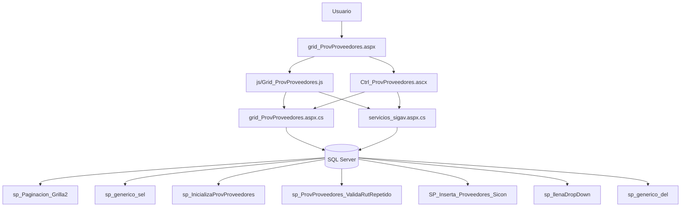
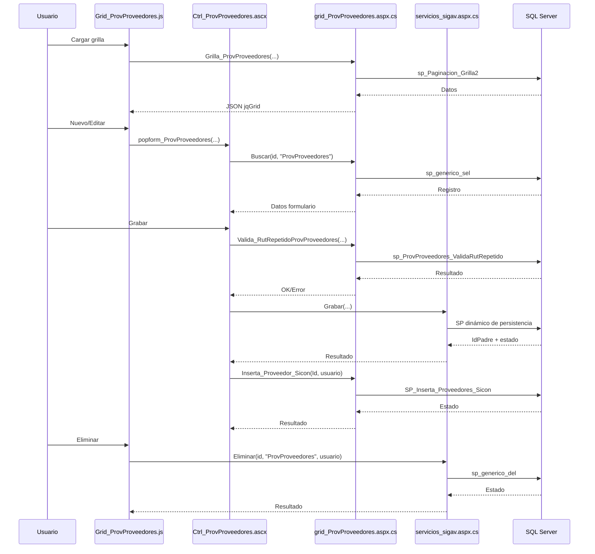

# Análisis de `grid_ProvProveedores.aspx`

## 1) Descripción y función

`grid_ProvProveedores.aspx` es el componente de mantenimiento de proveedores (`ProvProveedores`) en el módulo de maestros de proveedores.

Cubre un CRUD amplio con reglas de negocio adicionales:
- validación de RUT,
- validación de RUT repetido,
- sincronización posterior con SICON,
- múltiples parámetros comerciales/contables y geográficos.

---

## 2) Dependencias

### Archivos
- `grid_ProvProveedores.aspx`
- `grid_ProvProveedores.aspx.cs`
- `js/Grid_ProvProveedores.js`
- `ControlUser/Ctrl_ProvProveedores.ascx`
- `ControlUser/Ctrl_ProvProveedores.ascx.cs`

### Métodos C# (WebMethods)
En `grid_ProvProveedores.aspx.cs`:
- `InicializaProvProveedores(idUsuario)`
- `Buscar(id_reg, tabla)`
- `Grilla_ProvProveedores(...)`
- `Inserta_Proveedor_Sicon(IdProvProveedores, usuario)`
- `Valida_RutRepetidoProvProveedores(IdProvProveedores, Rut, usuario)`
- DTO `ProvProveedores`
- `JQGridJsonResponse_ProvProveedores`

En `servicios/servicios_sigav.aspx.cs`:
- `Grabar(...)`
- `Eliminar(...)`
- `CargaDDL(...)`
- `Caption_Option(...)`

### JS principales
En `Grid_ProvProveedores.js`:
- `Grilla_ProvProveedores(...)`
- `Accion_ProvProveedores(...)`
- `Caption(...)`, `Filtros(...)`

En `Ctrl_ProvProveedores.ascx`:
- `popform_ProvProveedores(...)`
- `BuscarDatos_ProvProveedores(...)`
- `Grabar_ProvProveedores(...)`
- `ParametrosGrabar_ProvProveedores`, `ParametrosValidacion_ProvProveedores`, `ParamValObligatorios_ProvProveedores`
- `Valida_RutRepetidoProvProveedores(...)`
- `Inserta_Proveedor_Sicon(...)`
- `InicializaProvProveedores(...)`
- múltiples `DDL...` para combos dependientes.

### SP detectados
- `sp_Paginacion_Grilla2`
- `sp_generico_sel`
- `sp_InicializaProvProveedores`
- `SP_Inserta_Proveedores_Sicon`
- `sp_ProvProveedores_ValidaRutRepetido`
- `sp_llenaDropDown`
- `sp_generico_del` (vía servicio genérico)

---

## 3) Flujo CRUD e interacciones

## Create
1. `Accion_ProvProveedores(...,0)` abre modal.
2. Inicializa combos y valores por defecto (`InicializaProvProveedores` + `CargaDDL`).
3. Validación de campos (`DatosValidacion_ProvProveedores`) y RUT (`$.Rut.validar`).
4. Validación de duplicidad de RUT (`Valida_RutRepetidoProvProveedores`).
5. `Grabar_ProvProveedores` llama `servicios_sigav.aspx/Grabar` con gran set de parámetros.
6. Al éxito, refresca grilla y ejecuta `Inserta_Proveedor_Sicon`.

## Read
- Grilla: `Grilla_ProvProveedores` -> `sp_Paginacion_Grilla2`.
- Edición/detalle: `Buscar` -> `sp_generico_sel`.
- Vista detalle (`accion=4`) abre formulario en modo de solo lectura.

## Update
1. `Accion_ProvProveedores(...,1)`.
2. `BuscarDatos_ProvProveedores` llena campos y flags.
3. Mismas validaciones que alta.
4. `Grabar` con `accion=1` persiste cambios.
5. Se sincroniza con SICON.

## Delete
1. `Accion_ProvProveedores(...,3)` -> `eliminareg`.
2. Confirmación y llamada a `servicios_sigav.aspx/Eliminar`.
3. Persistencia por `sp_generico_del`.
4. Recarga de grilla.

## Clone / View
- `accion=2`: clona registro reutilizando flujo modal.
- `accion=4`: visualización en `form_ProvProveedores.aspx`.

---

## 4) Diagrama de objetos

### Diagrama de proceso CRUD

---

## 5) Relaciones de datos

`ProvProveedores` tiene múltiples relaciones con entidades de configuración y maestros.

Para información detallada sobre esta y otras relaciones del sistema, consultar:  
📘 **[Relaciones entre Entidades - Sistema SIGAV](../../Relaciones_Entidades.md#provproveedores-a-provtipoproveedor)**

---

## 6) Características especiales

### Validaciones de negocio complejas
- **Validación de RUT**: verificación de formato y dígito verificador (plugin jQuery.Rut)
- **RUT único**: validación de duplicidad mediante `sp_ProvProveedores_ValidaRutRepetido`
- **Múltiples reglas de negocio**: flags y parámetros comerciales/contables

### Sincronización externa
- **Integración con SICON**: post-inserción/actualización mediante `SP_Inserta_Proveedores_Sicon`
- Sincronización de datos de proveedor con sistema externo

### Alta densidad de campos
- Más de 20 campos en el formulario
- Múltiples dropdowns dependientes
- Organización en tabs o secciones para mejorar usabilidad

### Filtros dinámicos
- Soporte para 3 filtros simultáneos
- Columnas filtrables generadas dinámicamente
- Filtros persistentes entre recargas

### Responsividad
- Ancho de columnas calculado como porcentajes de ventana
- Alto de grilla adaptativo
- Filas por página calculadas dinámicamente

### Seguridad
- Validación de perfil por usuario
- Log de accesos y eventos
- Parámetros encriptados en URLs

### Exportación
- Botones para exportar a Excel y CSV
- Función `ExportGrilla` con delimitadores configurables

### Auditoría
- Registro de apertura/cierre de formulario
- Usuario y timestamp en todas las operaciones CRUD
- Trazabilidad completa de modificaciones

---

## 7) Estructura de datos

### Tabla ProvProveedores (inferida)

| Campo | Tipo | Null | Descripción |
|-------|------|------|-------------|
| IdProvProveedores | int | No | PK, Identity |
| Nombre | varchar(100) | No | Nombre del proveedor |
| RazonSocial | varchar(150) | Sí | Razón social |
| Rut | varchar(12) | No | RUT del proveedor (único) |
| DigitoVerificador | char(1) | No | Dígito verificador del RUT |
| IdProvTipoProveedor | int | Sí | FK a ProvTipoProveedor |
| IdProvHolding | int | Sí | FK a ProvHolding |
| IdMaeSucursal | int | Sí | FK a MaeSucursal |
| IdProvEstado | int | Sí | FK a ProvEstado |
| ContactoPrincipal | varchar(100) | Sí | Nombre del contacto principal |
| EmailContacto | varchar(100) | Sí | Email del contacto |
| TelefonoContacto | varchar(20) | Sí | Teléfono del contacto |
| DireccionPrincipal | varchar(200) | Sí | Dirección física |
| IdGeoPais | int | Sí | FK a GeoPais |
| IdGeoCiudad | int | Sí | FK a GeoCiudad |
| IdGeoComuna | int | Sí | FK a GeoComuna |
| CondicionesPago | varchar(100) | Sí | Condiciones comerciales |
| DiasPlazo | int | Sí | Días de plazo de pago |
| FechaCreacion | datetime | Sí | Timestamp de creación |
| UsuarioCreacion | varchar(50) | Sí | Usuario que creó el registro |
| FechaModificacion | datetime | Sí | Timestamp de última modificación |
| UsuarioModificacion | varchar(50) | Sí | Usuario que modificó el registro |
| Eliminado | bit | Sí | Flag de soft delete |

### Índices (sugeridos)
- PK en `IdProvProveedores`
- Unique Index en `Rut` para garantizar unicidad
- FK en `IdProvTipoProveedor`
- FK en `IdProvHolding`
- FK en `IdMaeSucursal`
- FK en `IdProvEstado`
- Index en `Nombre` para búsquedas
- Index en `RazonSocial` para búsquedas
- Index filtrado en `Eliminado = 0` para consultas activas

---

## 8) Resumen

`grid_ProvProveedores.aspx` implementa un CRUD WebForms completo y robusto para la gestión de proveedores, con:

- **jqGrid** con paginación, ordenamiento y filtros múltiples
- **Modal jQuery UI** para edición con alta densidad de campos
- **Validaciones complejas** (RUT, duplicidad, reglas de negocio)
- **Sincronización externa** con sistema SICON
- **Servicios genéricos** de persistencia y eliminación
- **SPs parametrizados** para consulta y manipulación de datos
- **Múltiples relaciones** con entidades de configuración (tipo, holding, sucursal, estado, geografía)
- **Exportación** a Excel y CSV
- **Seguridad** basada en perfiles y auditoría completa
- **Diseño responsivo** adaptado a tamaño de ventana

Es un componente **maestro central** del módulo de proveedores, con alta complejidad debido a la cantidad de campos, validaciones especiales (RUT único), sincronización externa y múltiples relaciones. Sirve como entidad base para gestión de compras, pagos y relaciones comerciales.

### Casos de uso principales

1. **Gestión de proveedores**: crear, modificar, consultar y eliminar proveedores con validación de RUT
2. **Búsqueda avanzada**: localizar proveedores por múltiples criterios
3. **Exportación de datos**: generar catálogos en Excel/CSV
4. **Sincronización**: integrar datos con sistema externo SICON
5. **Auditoría**: rastrear cambios y accesos al maestro de proveedores
6. **Gestión comercial**: mantener condiciones de pago y contactos de proveedores
