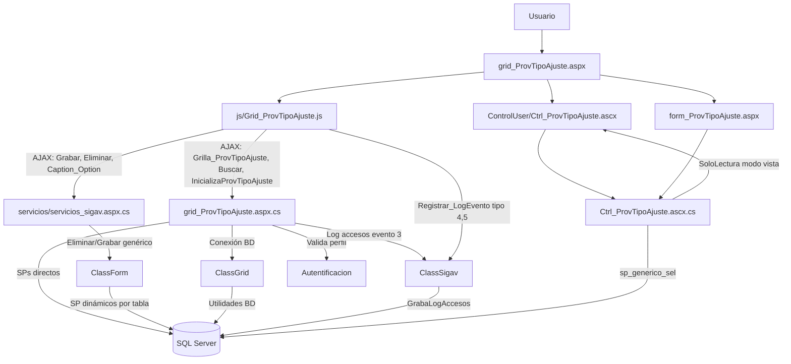
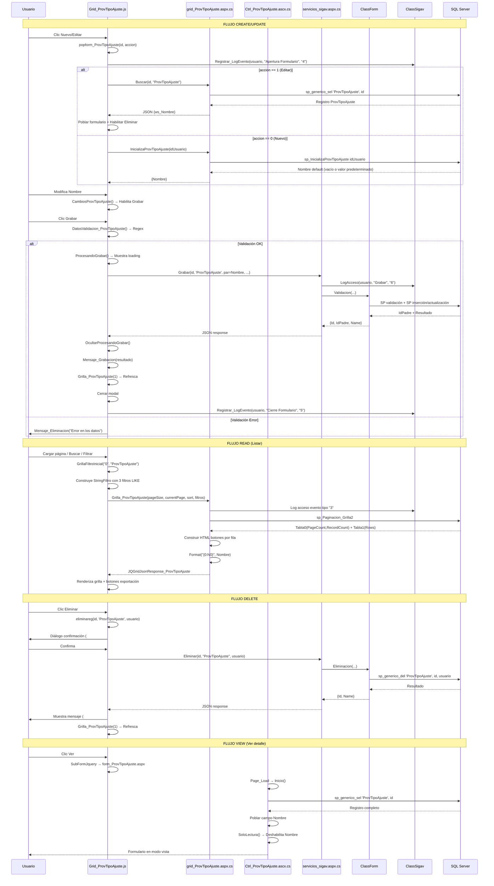

# Análisis de `grid_ProvTipoAjuste.aspx`

## 1) Descripción y función

`grid_ProvTipoAjuste.aspx` es el componente de mantenimiento de **Tipos de Ajuste de Proveedores** en la capa WebForms del módulo de maestros de proveedores.

Su función principal es implementar el flujo CRUD sobre la entidad `ProvTipoAjuste` mediante:

- una **grilla jqGrid** para búsqueda, paginación y acciones por fila,
- un **formulario modal** (`Ctrl_ProvTipoAjuste.ascx`) para alta/edición/clonación,
- servicios AJAX (`WebMethod`) en `grid_ProvTipoAjuste.aspx.cs` y `servicios/servicios_sigav.aspx.cs`.

Un **tipo de ajuste** representa una categoría de ajustes o modificaciones que se pueden aplicar a proveedores, sus cuentas o transacciones (ej: ajuste por diferencia de cambio, ajuste por descuento, ajuste por penalización, ajuste por bonificación, etc.), permitiendo clasificar y rastrear diferentes tipos de correcciones o modificaciones en el sistema.

---

## 2) Artefactos involucrados

### Página y control

- `grid_ProvTipoAjuste.aspx`
- `grid_ProvTipoAjuste.aspx.cs` (la directiva apunta a `grId_ProvTipoAjuste.aspx.cs`)
- `ControlUser/Ctrl_ProvTipoAjuste.ascx`
- `ControlUser/Ctrl_ProvTipoAjuste.ascx.cs`
- `form_ProvTipoAjuste.aspx` (vista detalle/solo lectura - inferido)
- `form_ProvTipoAjuste.aspx.cs` (inferido)

### JavaScript principal

- `js/Grid_ProvTipoAjuste.js`

### Servicios comunes

- `servicios/servicios_sigav.aspx.cs`

---

## 3) Dependencias JS (objetos y funciones)

### Grilla (`js/Grid_ProvTipoAjuste.js`)

- **`Grilla_ProvTipoAjuste(filtro, NombreCol, OrdenCol, filas)`**:
  - inicializa jqGrid con configuración responsiva,
  - llama por AJAX a `grid_ProvTipoAjuste.aspx/Grilla_ProvTipoAjuste`,
  - aplica hasta **3 filtros simultáneos** con operador `LIKE`,
  - construye botones de exportación (`Excel`, `CSV`),
  - calcula filas automáticamente según altura de ventana: `parseInt(($(window).height() - 200) / 23)`.

- **`Accion_ProvTipoAjuste(id, accion, idpadre, usuario)`**:
  - `0`: Nuevo → `popform_ProvTipoAjuste`
  - `1`: Editar → `popform_ProvTipoAjuste`
  - `2`: Clonar → `popform_ProvTipoAjuste`
  - `3`: Eliminar → `eliminareg`
  - `4`: Ver detalle → `SubFormJquery` con `form_ProvTipoAjuste.aspx`

- **`Caption(ifilter1, iColumn1, ifilter2, iColumn2, ifilter3, iColumn3, iTabla, filas, NombreCol, OrdenCol)`**:
  - genera barra de herramientas con botones (Buscar, Limpiar, Nuevo, Cerrar),
  - incluye los 3 filtros dinámicos.

- **`Filtros(ifilter, iColumn, iTabla, NroFiltro)`**:
  - genera UI de cada filtro (combo + input),
  - usa `servicios_sigav.aspx/Caption_Option` para obtener columnas filtrables,
  - aplica restricción de entrada: `onkeypress="return SoloAlfanumerico(event)"`.

### Formulario modal (`Ctrl_ProvTipoAjuste.ascx`)

- **`popform_ProvTipoAjuste(...)`**: 
  - abre modal jQuery UI (750x550px),
  - orquesta flujo CRUD con tres botones: Grabar, Eliminar, Cerrar,
  - registra eventos de apertura/cierre mediante `Registrar_LogEvento`.

- **`BuscarDatos_ProvTipoAjuste(id, tabla, accion, hijo, idpadre, TablaOrigen, id_Origen)`**: 
  - carga datos para edición/clonado llamando `grid_ProvTipoAjuste.aspx/Buscar`,
  - popula único campo del formulario: `Nombre`.

- **`Grabar_ProvTipoAjuste(id, tabla, accion, hijo, usuario, idProceso, CallBack)`**: 
  - persiste cambios llamando `servicios_sigav.aspx/Grabar`,
  - construye 3 conjuntos de parámetros: `ParametrosGrabar`, `ParametrosValidacion`, `ParamValObligatorios`,
  - muestra indicadores de procesamiento (`ProcesandoGrabar`, `OcultarProcesandoGrabar`),
  - refresca grilla al éxito.

- **`DatosValidacion_ProvTipoAjuste()`**: 
  - valida formato de campos con expresiones regulares:
    - `IdProvTipoAjuste`: `/^[0-9]{0,10}$/`
    - `Nombre`: `/^[a-zA-Z0-9_.,:ñÑáéíóúÁÉÍÓÚ()=<>°$%@\/\*\+\s\-\\]+$/`
  - muestra mensajes específicos por campo con ejemplo de formato esperado.

- **`LimpiaDatos_ProvTipoAjuste(accion)`**: 
  - limpia campos del formulario,
  - deshabilita `IdProvTipoAjuste` (auto-generado),
  - habilita campo `Nombre` para edición.

- **`CambiosProvTipoAjuste()`**: 
  - detecta cambios en formulario mediante evento `change`,
  - habilita botón Grabar solo si hay modificaciones (`$("#mod_ProvTipoAjuste").val()`),
  - versión simplificada sin combobox (solo inputs de texto).

- **Funciones auxiliares**:
  - `ParametrosGrabar_ProvTipoAjuste()`: construye string con único parámetro `Nombre`
  - `ParametrosValidacion_ProvTipoAjuste()`: parámetros `IdProvTipoAjuste` y `Nombre`
  - `ParamValObligatorios_ProvTipoAjuste()`: único campo obligatorio `Nombre`

---

## 4) Dependencias C# (métodos y clases)

### `grid_ProvTipoAjuste.aspx.cs`

- **`Page_Load(object sender, EventArgs e)`**:
  - controla autenticación (`HttpContext.Current.User.Identity.IsAuthenticated`),
  - valida perfil del usuario (`Autentificacion.ValidaPerfil(Session["IdUser"], "ProvTipoAjuste")`),
  - registra acceso mediante `ClassSigav.GrabaLogAccesos` (evento tipo "3" - acceso a grilla),
  - soporta apertura directa en modo edición por parámetro `IdRegistro` (encriptado vía `ClassGrid.EncriptaDesEncriptaDatos`),
  - redirige a `Dashboard.aspx` si usuario sin permisos,
  - abre modal de login si sesión no autenticada.

- **WebMethods**:
  - **`InicializaProvTipoAjuste(string idUsuario)`**: 
    - devuelve valores iniciales para nuevos registros,
    - ejecuta `sp_InicializaProvTipoAjuste`,
    - retorna único campo `Nombre` por defecto (puede estar vacío o con valor predeterminado).
  
  - **`Buscar(string id_reg, string tabla)`**: 
    - busca registro por ID usando `sp_generico_sel`,
    - retorna objeto `ProvTipoAjuste` con único campo `ws_Nombre`.
  
  - **`Grilla_ProvTipoAjuste(int pPageSize, int pCurrentPage, string pSortColumn, string pSortOrder, string tabla, string pSearchField, string pSearchString)`**: 
    - implementa paginación servidor,
    - ejecuta `sp_Paginacion_Grilla2`,
    - construye botones de acción HTML por fila (Editar, Clonar, Eliminar, Ver),
    - procesa filtros dinámicos reemplazando `#%` por `'%` y `%#` por `%'`,
    - aplica formato `String.Format("{0:N0}", row["Nombre"])` a columna Nombre,
    - retorna `JQGridJsonResponse_ProvTipoAjuste` con metadatos de paginación.

- **Clases**:
  - **`ProvTipoAjuste`**: 
    - DTO de la entidad con propiedades: 
      - `ws_IdProvTipoAjuste` (Int32)
      - `ws_Nombre` (string) - **único campo editable**
      - `ws_Botones` (string, HTML de botones de acción)
    - método `Encontrar(id_reg, sp_buscar, tabla)`: ejecuta búsqueda por ID mediante `sp_generico_sel`
  
  - **`BtnProvTipoAjuste`**: 
    - mensajes de estado: `ws_IdMensaje`, `ws_Descripcion`
  
  - **`JQGridJsonResponse_ProvTipoAjuste`**: 
    - respuesta paginada para jqGrid con propiedades:
      - `PageCount`: número total de páginas
      - `CurrentPage`: página actual
      - `RecordCount`: total de registros
      - `Items`: lista de `ClassGrid.JQGridItem`

### `ControlUser/Ctrl_ProvTipoAjuste.ascx.cs`

- **`Page_Load(object sender, EventArgs e)`**: 
  - maneja apertura directa vía QueryString (`tabla=ProvTipoAjuste`, `id=...`),
  - llama a `Inicio()` para modo visualización si no es PostBack.

- **`Inicio()`**: 
  - modo visualización/detalle,
  - obtiene `id` desde QueryString,
  - carga registro vía `BuscaProvTipoAjuste`,
  - aplica `SoloLectura()`.

- **`BuscaProvTipoAjuste(string IdProvTipoAjuste)`**: 
  - ejecuta `sp_generico_sel 'ProvTipoAjuste', '{id}'`,
  - popula único control del formulario:
    - `Nombre`: campo de texto con nombre del tipo de ajuste.

- **`SoloLectura()`**: 
  - deshabilita único control para modo visualización:
    - `Nombre.Enabled = false`.

### `servicios/servicios_sigav.aspx.cs`

- **`Grabar(...)`**: 
  - delega validación y persistencia en `ClassForm.Validacion(...)`,
  - registra evento de grabación mediante `LogAcceso` (evento tipo "6"),
  - parámetros: `id_reg`, `tabla`, `par` (solo `Nombre`), `parval`, `parvalobligatorio`, `accion`, `hijo`, `usuario`, `idProceso`, `DirPrincipal`, `DirDespacho`,
  - resuelve dinámicamente SP de validación y persistencia por tabla.

- **`Eliminar(id_reg, tabla, usuario)`**: 
  - eliminación genérica vía `ClassForm.Eliminacion(..., "sp_generico_del", ...)`,
  - registra evento de eliminación.

- **`CargaDDL(id_padre, tabla, filtro, campo, accion)`**: 
  - **NO utilizado en este componente** (no hay combos),
  - presente como servicio disponible del framework.

- **`Caption_Option(filtro, columna, tabla)`**: 
  - genera opciones de columnas filtrables para dropdown de filtros,
  - ejecuta `sp_generico_option`,
  - retorna lista de objetos con propiedad `ws_Caption`.

---

## 5) Procedimientos almacenados de servidor (detectados)

### Directos desde el componente:

- **`sp_Paginacion_Grilla2`**: 
  - listado paginado con soporte de ordenamiento y filtros múltiples,
  - parámetros: 
    - `@PageSize` (int): registros por página
    - `@CurrentPage` (int): página actual
    - `@SortColumn` (varchar 40): columna de ordenamiento
    - `@SortOrder` (varchar 4): dirección (asc/desc)
    - `@tabla` (varchar 50): 'ProvTipoAjuste'
    - `@filtro` (varchar 1000): condiciones WHERE dinámicas
    - `@IdUsuario` (varchar 50): usuario para filtros personalizados
  - retorna dos tablas:
    - tabla 0: `PageCount`, `CurrentPage`, `RecordCount`
    - tabla 1: filas de datos con columnas `IdProvTipoAjuste`, `Nombre`

- **`sp_generico_sel`**: 
  - búsqueda de registro por ID,
  - parámetros: `@tabla='ProvTipoAjuste'`, `@id_reg`,
  - retorna campos del registro:
    - `IdProvTipoAjuste`
    - `Nombre`
    - campos de auditoría (FechaCreacion, UsuarioCreacion, etc.)

- **`sp_InicializaProvTipoAjuste`**: 
  - valores iniciales para nuevos registros,
  - parámetro: `@idUsuario`,
  - retorna campo `Nombre` por defecto (probablemente vacío o valor predeterminado),
  - puede incluir lógica de inicialización específica según perfil.

### Indirectos/generales usados en el flujo:

- **`sp_generico_del`**: 
  - eliminación genérica (vía `servicios_sigav.aspx/Eliminar`),
  - parámetros: `@tabla`, `@id_reg`, `@usuario`,
  - realiza soft delete (`Eliminado=1`) o hard delete según configuración de tabla,
  - puede incluir validaciones de integridad referencial (si hay ajustes usando este tipo).

- **`sp_generico_option`**: 
  - genera opciones de filtros de columnas,
  - parámetros: `@filtro`, `@columna`, `@tabla='ProvTipoAjuste'`,
  - retorna lista de campos disponibles para filtrado con estructura HTML `<option>`,
  - campo retornado: `NombreCampo`.

- **Procedimientos de inserción/actualización** (inferidos): 
  - invocados desde `ClassForm.Validacion(...)` en `servicios_sigav.aspx/Grabar`,
  - resolución dinámica por tabla,
  - probablemente `sp_ProvTipoAjuste_ins` y `sp_ProvTipoAjuste_upd`,
  - pueden incluir validaciones de negocio específicas (ej: nombre único).

---

## 6) Flujo CRUD e interacciones

### Create (Nuevo)

1. Usuario pulsa botón **Nuevo** en Caption de grilla.
2. `Accion_ProvTipoAjuste(0, 0, 0)` en `Grid_ProvTipoAjuste.js` invoca `popform_ProvTipoAjuste` con `accion=0`.
3. Modal se abre con título "Nuevo ProvTipoAjuste" (750x550px).
4. `LimpiaDatos_ProvTipoAjuste(0)`:
   - limpia campo `Nombre`,
   - deshabilita `IdProvTipoAjuste` (auto-generado),
   - habilita campo `Nombre` para edición.
5. `CambiosProvTipoAjuste()` activa detección de cambios (botón Grabar deshabilitado inicialmente).
6. `Registrar_LogEvento` registra apertura de formulario (evento tipo "4").
7. Usuario ingresa datos en único campo:
   - **Nombre** (obligatorio, máx. 50 caracteres, alfanumérico con caracteres especiales)
8. Al modificar el campo, `CambiosProvTipoAjuste` habilita botón **Grabar**.
9. Usuario pulsa **Grabar**.
10. `DatosValidacion_ProvTipoAjuste()` valida formato de campo con regex:
    - retorna `false` y muestra mensaje específico si hay error,
    - mensaje incluye ejemplo de formato esperado: "Sólo Texto, Números y (.,:%-)".
11. Si validación OK, muestra indicador `ProcesandoGrabar()`.
12. `Grabar_ProvTipoAjuste` construye 3 conjuntos de parámetros:
    - `ParametrosGrabar`: `"'" + Nombre + "'"`
    - `ParametrosValidacion`: `"'" + IdProvTipoAjuste + "','" + Nombre + "'"`
    - `ParamValObligatorios`: `"'" + Nombre + "'"`
13. Llama `servicios/servicios_sigav.aspx/Grabar` con parámetros.
14. Backend (`ClassForm.Validacion`) ejecuta SP de validación y persistencia.
15. Al éxito, retorna `IdPadre` (nuevo ID), `Id` (resultado), `Name` (mensaje).
16. `OcultarProcesandoGrabar()` oculta indicador.
17. `Mensaje_Grabacion` muestra resultado al usuario.
18. `Grilla_ProvTipoAjuste(1)` refresca la grilla.
19. Modal se cierra.
20. `Registrar_LogEvento` registra cierre de formulario (evento tipo "5").

### Read (Listar / Ver)

#### Listar
1. `Grilla_ProvTipoAjuste()` se ejecuta al cargar página (jQuery ready).
2. Obtiene filtros iniciales mediante `GrillaFiltroInicial('0', 'ProvTipoAjuste')`.
3. Construye `StringFiltro` con operadores `LIKE` para cada filtro activo.
4. Calcula filas por página: `parseInt(($(window).height() - 200) / 23)`.
5. Ejecuta AJAX a `grid_ProvTipoAjuste.aspx/Grilla_ProvTipoAjuste`.
6. Backend:
   - ejecuta `sp_Paginacion_Grilla2` con parámetros de paginación, ordenamiento y filtros,
   - obtiene `PageCount`, `CurrentPage`, `RecordCount` de tabla 0,
   - obtiene filas de datos de tabla 1,
   - construye HTML de botones por fila,
   - aplica formato `{0:N0}` a columna Nombre.
7. Retorna JSON con estructura jqGrid.
8. Grilla renderiza filas con columnas:
   - **IdProvTipoAjuste** (10% ancho)
   - **Nombre** (75% ancho, formato numérico `{0:N0}`)
   - **Botones** (180px fijo): Editar, Clonar, Eliminar, Ver
9. Navega con paginador jqGrid.

#### Ver detalle
1. Usuario pulsa botón **Ver** (icono info) en fila de grilla.
2. `Accion_ProvTipoAjuste(id, 4, id, usuario)` invoca `SubFormJquery`.
3. Abre `form_ProvTipoAjuste.aspx?id={id}&accion=&tabla=ProvTipoAjuste` en modal jQuery UI.
4. `Ctrl_ProvTipoAjuste.ascx.cs/Page_Load` detecta QueryString.
5. `Inicio()`:
   - obtiene `id` desde QueryString,
   - llama `BuscaProvTipoAjuste(id)`.
6. `BuscaProvTipoAjuste`:
   - ejecuta `sp_generico_sel 'ProvTipoAjuste', '{id}'`,
   - popula campo `Nombre`.
7. `SoloLectura()` deshabilita campo para visualización.
8. Usuario consulta datos sin poder editarlos.

### Update (Editar)

1. Usuario pulsa botón **Editar** en fila de grilla.
2. `Accion_ProvTipoAjuste(id, 1, id, usuario)` abre `popform_ProvTipoAjuste` con `accion=1`.
3. Modal se abre con título "Edición del ProvTipoAjuste".
4. `BuscarDatos_ProvTipoAjuste` llama `grid_ProvTipoAjuste.aspx/Buscar` con `id_reg`.
5. Backend ejecuta `sp_generico_sel 'ProvTipoAjuste', '{id}'`.
6. Respuesta JSON popula campo del formulario:
   - `$('#IdProvTipoAjuste').val(id)` (deshabilitado),
   - `$('#Nombre').val(ws_Nombre)`.
7. Botón **Eliminar** habilitado (solo en edición).
8. Usuario modifica campo (habilita botón Grabar por detección de cambios).
9. Validaciones de formato con `DatosValidacion_ProvTipoAjuste()`.
10. `Grabar_ProvTipoAjuste` con `accion=1` persiste cambios.
11. Backend actualiza registro existente en tabla `ProvTipoAjuste`.
12. Grilla se refresca mostrando cambios.
13. Modal se cierra.

### Delete (Eliminar)

#### Desde grilla
1. Usuario pulsa botón **Eliminar** en fila.
2. `Accion_ProvTipoAjuste(id, 3, id, usuario)` invoca `eliminareg(id, 'ProvTipoAjuste', '', '', usuario)`.
3. Modal de confirmación jQuery UI con texto: "Está a punto de eliminar un registro?".
4. Si confirma, ejecuta AJAX a `servicios/servicios_sigav.aspx/Eliminar`.
5. Backend:
   - llama `ClassForm.Eliminacion`,
   - ejecuta `sp_generico_del 'ProvTipoAjuste', '{id}', '{usuario}'`,
   - SP realiza soft delete (`UPDATE ... SET Eliminado=1`) o hard delete según configuración,
   - puede validar si existen ajustes usando este tipo antes de eliminar.
6. Retorna objeto con `Id` (resultado), `Name` (mensaje).
7. UI muestra mensaje de resultado en modal `#dialog-mensaje`.
8. `Grilla_ProvTipoAjuste(1)` refresca datos.

#### Desde formulario
1. Usuario abre tipo de ajuste en modo edición (`accion=1`).
2. Pulsa botón **Eliminar** en modal.
3. Valida que `accion == "1"` (solo permite eliminar en edición, no en nuevo).
4. Ejecuta `eliminareg(id, tabla, '', '', usuario)`.
5. Mismo flujo de confirmación y eliminación.
6. Adicional: modal se cierra automáticamente.

### Clone (Clonar)

1. Usuario pulsa botón **Clonar** en fila.
2. `Accion_ProvTipoAjuste(id, 2, id, usuario)` abre modal con `accion=2`.
3. Título del modal: "Clonación del ProvTipoAjuste".
4. `BuscarDatos_ProvTipoAjuste` carga datos del registro original.
5. `IdProvTipoAjuste` permanece deshabilitado y vacío (se generará nuevo ID).
6. Usuario puede modificar `Nombre` según necesidad.
7. `Grabar_ProvTipoAjuste` con `accion=2` crea nuevo registro.
8. Backend lo trata como inserción.
9. Nuevo registro aparece en grilla con ID diferente.

---

## 7) Diagrama de objetos (Mermaid)

---

## 8) Diagrama de proceso CRUD (Mermaid)

---

## 9) Relaciones de datos

`ProvTipoAjuste` es una entidad de catálogo del módulo de proveedores que clasifica diferentes tipos de ajustes o modificaciones que se pueden aplicar.

### Relaciones detectadas

**Relación inferida** (no implementada en este componente):
- **Ajustes/Transacciones → ProvTipoAjuste** (Many-to-One): 
  - campo `IdProvTipoAjuste` en tablas de ajustes de proveedores
  - permite clasificar cada ajuste por su tipo
  - relación opcional o requerida según reglas de negocio

**Características especiales**:
- No tiene relación con `MaeEmpresa`
- Es un **catálogo global** del sistema, no segmentado por empresa
- Simplifica la gestión (un solo conjunto de tipos para todo el sistema)

Para información detallada sobre las relaciones de esta entidad con otras del sistema, consultar:  
📘 **[Relaciones entre Entidades - Sistema SIGAV](../../Relaciones_Entidades.md#módulo-proveedores)**

---

## 10) Características especiales

### Diseño ultra-minimalista
- Solo **1 campo editable**: `Nombre`
- **Sin relación con empresa** (catálogo global del sistema)
- Formulario enfocado exclusivamente en clasificación
- Arquitectura simplificada sin combos ni relaciones complejas

### Validaciones básicas pero efectivas
- **Formato de nombre**: `/^[a-zA-Z0-9_.,:ñÑáéíóúÁÉÍÓÚ()=<>°$%@\/\*\+\s\-\\]+$/`
- **Campo numérico ID**: `/^[0-9]{0,10}$/`
- **Mensajes específicos**: incluyen ejemplo de formato esperado
- **Detección de cambios**: botón Grabar solo habilitado si hay modificaciones
- **Validación HTML5**: atributo `required` y `pattern` en input

### Filtros dinámicos avanzados
- Soporte para **3 filtros simultáneos** con operador `LIKE`
- Columnas filtrables generadas dinámicamente vía `Caption_Option`
- Filtros persistentes entre recargas mediante `GrillaFiltroInicial`
- Restricción de entrada: `onkeypress="return SoloAlfanumerico(event)"`
- Conversión automática a mayúsculas en filtros: `.toUpperCase().trim()`

### Responsividad completa
- **Ancho de columnas** calculado como porcentajes de ventana:
  - `IdProvTipoAjuste`: 10%
  - `Nombre`: 75% (con formato numérico `{0:N0}`)
  - `Botones`: 180px fijo
- **Alto de grilla** adaptativo: `$(window).height() - 200`
- **Filas por página** dinámicas: `parseInt(($(window).height() - 200) / 23)`
- Ancho total: `$(window).width() - 50`

### Seguridad multi-capa
- **Validación de perfil** por usuario: `Autentificacion.ValidaPerfil(Session["IdUser"], "ProvTipoAjuste")`
- **Log de accesos** detallado: usuario, hostname, IP, user agent, referrer, tipo de evento
- **Parámetros encriptados** en URLs: `ClassGrid.EncriptaDesEncriptaDatos` para `IdRegistro`
- **Redirección automática** a Dashboard si sin permisos
- **Modal de login** si sesión no autenticada
- **Control de botón Eliminar**: solo habilitado en modo edición (`accion==1`)

### Exportación de datos
- Botón **Excel** (`.xls`) con delimitador `\t` (tabulador)
- Botón **CSV** (`.csv`) con delimitador `;` (punto y coma)
- Función genérica `ExportGrilla` del framework
- Exporta datos visibles en grilla según filtros aplicados

### Auditoría completa
- **Log de apertura de formulario**: evento tipo "4" al abrir modal
- **Log de cierre de formulario**: evento tipo "5" al cerrar modal
- **Log de grabación**: evento tipo "6" en operación CREATE/UPDATE
- **Log de acceso a grilla**: evento tipo "3" en `Page_Load`
- Usuario y timestamp implícitos en todas las operaciones
- Trazabilidad completa mediante `ClassSigav.GrabaLogAccesos` y `Registrar_LogEvento`

### Indicadores de procesamiento
- `ProcesandoGrabar()`: muestra loading gif y mensaje "Procesando..."
- `OcultarProcesandoGrabar()`: oculta indicador al completar
- Mejora UX en operaciones asíncronas
- Bloquea botones Grabar/Eliminar durante procesamiento

### Formato de datos
- **Columna Nombre**: `String.Format("{0:N0}", row["Nombre"])`
- Formato numérico con separadores de miles (aunque es campo de texto)
- Configuración heredada de plantilla genérica

### Ventajas del diseño sin empresa
- **Reutilizable**: mismos tipos de ajuste para todas las empresas del sistema
- **Mantenimiento centralizado**: cambios se aplican globalmente
- **Consistencia**: nomenclatura uniforme en todo el sistema
- **Simplicidad**: menos parámetros, menos complejidad

---

## 11) Estructura de datos

### Tabla ProvTipoAjuste (inferida)

| Campo | Tipo | Null | Descripción |
|-------|------|------|-------------|
| IdProvTipoAjuste | int | No | PK, Identity |
| Nombre | varchar(50) | No | Nombre del tipo de ajuste |
| Estado | bit | Sí | Flag activo/inactivo (inferido) |
| FechaCreacion | datetime | Sí | Timestamp de creación |
| UsuarioCreacion | varchar(50) | Sí | Usuario que creó el registro |
| FechaModificacion | datetime | Sí | Timestamp de última modificación |
| UsuarioModificacion | varchar(50) | Sí | Usuario que modificó el registro |
| Eliminado | bit | Sí | Flag de soft delete |

### Índices (sugeridos)
- **PK** en `IdProvTipoAjuste`
- **Unique Index** en `Nombre` para evitar duplicados globales
- **Index** en `Nombre` para búsquedas y ordenamiento
- **Index filtrado** en `Eliminado = 0` para consultas de registros activos

### Campos obligatorios en formulario
- `Nombre` (obligatorio, max 50 caracteres, pattern HTML5)

### Validadores ASP.NET WebForms
- **RegularExpressionValidator** en `Nombre`: valida patrón alfanumérico con especiales
- **RequiredFieldValidator** en `Nombre`: valida campo obligatorio
- Color de error: `ForeColor="Red"`

---

## 12) Resumen

`grid_ProvTipoAjuste.aspx` implementa un CRUD WebForms **ultra-simplificado** para la gestión de tipos de ajustes de proveedores, con:

- **jqGrid responsiva** con paginación automática, ordenamiento y 3 filtros simultáneos
- **Modal jQuery UI** compacto (750x550) con **solo 1 campo editable**
- **Servicios genéricos** de persistencia y eliminación reutilizados del framework
- **SPs parametrizados** para consulta y manipulación de datos
- **Validaciones básicas** con mensajes explicativos (formato, obligatoriedad)
- **Exportación** a Excel y CSV con delimitadores configurables
- **Seguridad multi-capa** basada en perfiles, encriptación y auditoría completa (5 tipos de eventos)
- **Diseño responsivo** adaptado a tamaño de ventana con cálculos dinámicos
- **Catálogo global** sin segmentación por empresa
- **Indicadores UX** de procesamiento asíncrono

Es un componente **maestro de catálogo global** del módulo de proveedores, con **densidad mínima de campos** (solo 1 editable) y **alcance transversal**. Sirve como entidad de clasificación para categorizar ajustes aplicables a proveedores en todo el sistema.

### Casos de uso principales

1. **Gestión de tipos de ajuste**: crear, modificar, consultar y eliminar tipos de ajustes
2. **Clasificación de ajustes**: categorizar ajustes de proveedores por tipo (diferencia de cambio, descuento, penalización, etc.)
3. **Búsqueda y filtrado**: localizar tipos por nombre
4. **Exportación de catálogo**: generar listados de tipos en Excel/CSV
5. **Consulta rápida**: visualización de detalle en modo solo lectura
6. **Auditoría**: rastrear cambios y accesos al catálogo de tipos

### Patrón de diseño: Catálogo Global de Clasificación

Este componente sigue el patrón **Catálogo Global de Clasificación**, caracterizado por:
- Entidad mínima con **único campo editable**
- **Sin segmentación por empresa** (alcance global del sistema)
- Alta frecuencia de lectura, muy baja frecuencia de escritura
- Relación Many-to-One con transacciones de ajustes (inferida)
- Sirve como tabla de lookup universal
- Facilita consistencia de nomenclatura en todo el sistema
- Simplifica mantenimiento (un solo lugar para actualizar)

### Ventajas del diseño de catálogo global

- **Reutilización**: mismos tipos de ajuste para todas las empresas del sistema
- **Consistencia**: nomenclatura uniforme en todo el sistema
- **Mantenimiento centralizado**: cambios se aplican globalmente
- **Simplicidad**: menos parámetros y menor complejidad
- **Estandarización**: facilita integración y reportes consolidados
