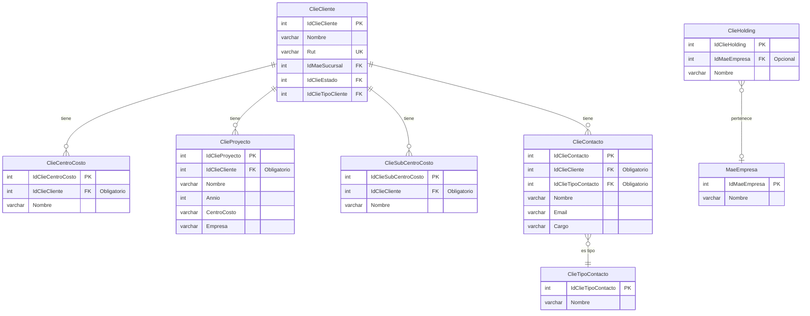
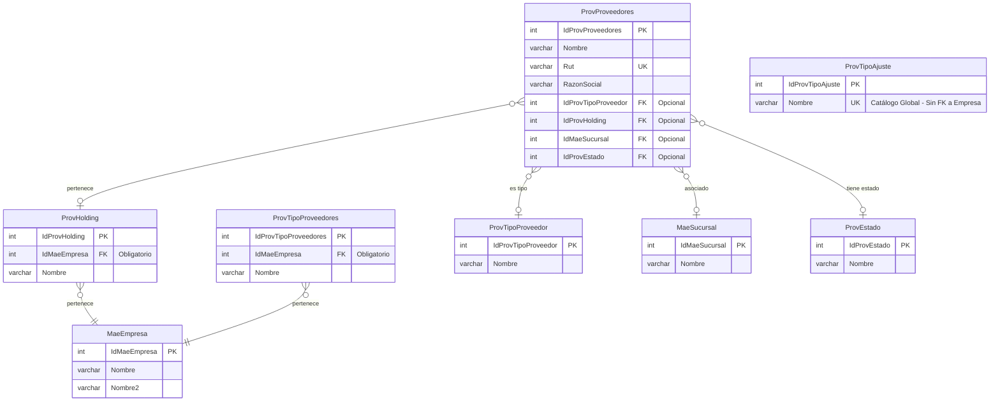

# Relaciones entre Entidades - Sistema SIGAV

Este documento centraliza todas las relaciones de clave foránea detectadas en el análisis de componentes del sistema.

---

## Índice de relaciones por módulo

- [Módulo Clientes](#módulo-clientes)
  - [ClieCentroCosto a ClieCliente](#cliecentrocosto-a-cliecliente)
  - [ClieContacto a ClieCliente](#cliecontacto-a-cliecliente)
  - [ClieContacto a ClieTipoContacto](#cliecontacto-a-clietipocontacto)
  - [ClieHolding a MaeEmpresa](#clieholding-a-maeempresa)
  - [ClieProyecto a ClieCliente](#clieproyecto-a-cliecliente)
  - [ClieSubCentroCosto a ClieCliente](#cliesubcentrocosto-a-cliecliente)
- [Módulo Proveedores](#módulo-proveedores)
  - [ProvProveedores a ProvTipoProveedor](#provproveedores-a-provtipoproveedor)
  - [ProvProveedores a ProvHolding](#provproveedores-a-provholding)
  - [ProvProveedores a MaeSucursal](#provproveedores-a-maesucursal)
  - [ProvProveedores a ProvEstado](#provproveedores-a-provestado)
- [Diagramas](#diagramas)
  - [Diagrama de Relaciones - Módulo Clientes](#diagrama-de-relaciones---módulo-clientes)
  - [Diagrama de Relaciones - Módulo Proveedores](#diagrama-de-relaciones---módulo-proveedores)

---

## Módulo Clientes

### ClieCentroCosto a ClieCliente

- **Campo**: `IdClieCliente` (obligatorio)
- **Tipo de relación**: Many-to-One (muchos centros de costo por cliente)
- **Propósito**: asocia centros de costo a clientes específicos para control presupuestario y seguimiento de costos por proyecto

### ClieContacto a ClieCliente

- **Campo**: `IdClieCliente` (obligatorio)
- **Tipo de relación**: Many-to-One (muchos contactos por cliente)
- **Propósito**: permite gestionar información de contacto de personas asociadas a clientes, incluyendo múltiples direcciones (principal y despacho)

### ClieContacto a ClieTipoContacto

- **Campo**: `IdClieTipoContacto` (obligatorio)
- **Tipo de relación**: Many-to-One (muchos contactos por tipo)
- **Propósito**: clasifica contactos según su función o rol (gerente, jefe de compras, contador, etc.)

### ClieHolding a MaeEmpresa

- **Campo**: `IdMaeEmpresa` (opcional)
- **Tipo de relación**: Many-to-One (muchos holdings por empresa)
- **Propósito**: asocia holdings a empresas del sistema para estructuras empresariales complejas

### ClieProyecto a ClieCliente

- **Campo**: `IdClieCliente` (obligatorio)
- **Tipo de relación**: Many-to-One (muchos proyectos por cliente)
- **Propósito**: asocia proyectos a clientes específicos, permitiendo la gestión de múltiples proyectos por cliente con información de año, centro de costo y empresa

### ClieSubCentroCosto a ClieCliente

- **Campo**: `IdClieCliente` (obligatorio)
- **Tipo de relación**: Many-to-One (muchos sub centros de costo por cliente)
- **Propósito**: permite agrupar sub centros de costo por cliente para control presupuestario detallado

---

## Módulo Proveedores

### ProvHolding a MaeEmpresa

- **Campo**: `IdMaeEmpresa` (obligatorio)
- **Tipo de relación**: Many-to-One (muchos holdings por empresa)
- **Propósito**: asocia holdings de proveedores a empresas del sistema para estructuras empresariales complejas

### ProvTipoProveedores a MaeEmpresa

- **Campo**: `IdMaeEmpresa` (obligatorio)
- **Tipo de relación**: Many-to-One (muchos tipos de proveedores por empresa)
- **Propósito**: asocia tipos de proveedores a empresas del sistema, permitiendo diferentes clasificaciones por empresa

### ProvTipoAjuste (sin relaciones con MaeEmpresa)

- **Característica**: Catálogo global del sistema sin segmentación por empresa
- **Propósito**: clasifica tipos de ajustes aplicables a proveedores de manera uniforme en todo el sistema
- **Nota**: A diferencia de ProvHolding y ProvTipoProveedores, ProvTipoAjuste es un catálogo transversal sin FK a MaeEmpresa

### ProvProveedores a ProvTipoProveedor

- **Campo**: `IdProvTipoProveedor` (opcional)
- **Tipo de relación**: Many-to-One (muchos proveedores por tipo)
- **Propósito**: clasifica proveedores según su categoría o tipo de servicio/producto

### ProvProveedores a ProvHolding

- **Campo**: `IdProvHolding` (opcional)
- **Tipo de relación**: Many-to-One (muchos proveedores por holding)
- **Propósito**: agrupa proveedores que pertenecen al mismo grupo empresarial

### ProvProveedores a MaeSucursal

- **Campo**: `IdMaeSucursal` (opcional)
- **Tipo de relación**: Many-to-One (muchos proveedores por sucursal)
- **Propósito**: asocia proveedores a sucursales específicas de la organización

### ProvProveedores a ProvEstado

- **Campo**: `IdProvEstado` (opcional)
- **Tipo de relación**: Many-to-One (muchos proveedores por estado)
- **Propósito**: controla el estado del proveedor (activo, inactivo, bloqueado, etc.)

---

## Diagramas

### Diagrama de Relaciones - Módulo Clientes

---

### Diagrama de Relaciones - Módulo Proveedores

---

## Notas

- Este documento se actualiza automáticamente con cada nuevo análisis de componente.
- Las relaciones se organizan por módulo funcional para facilitar su navegación.
- Para ver la implementación técnica de cada relación, consultar el documento de análisis del componente correspondiente.
