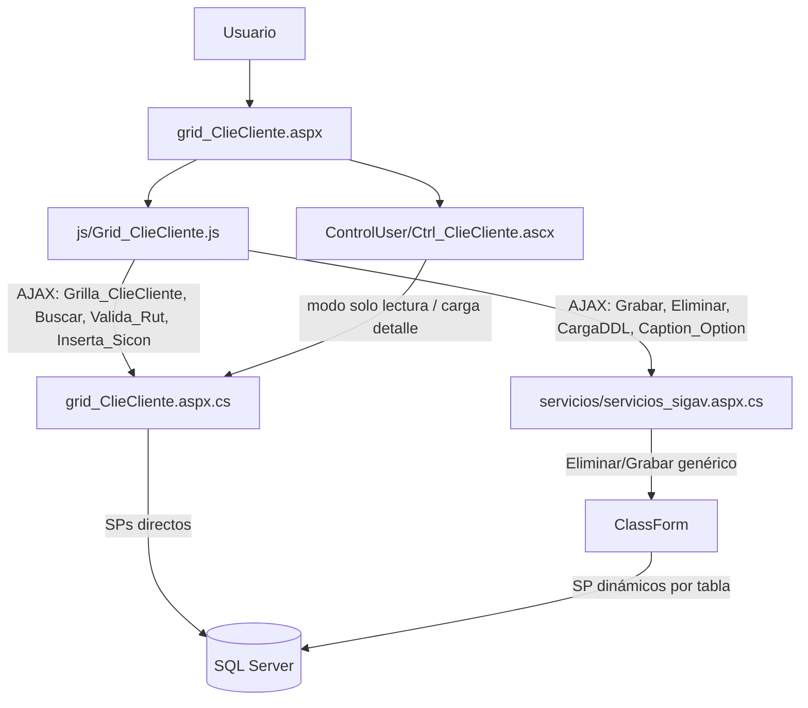
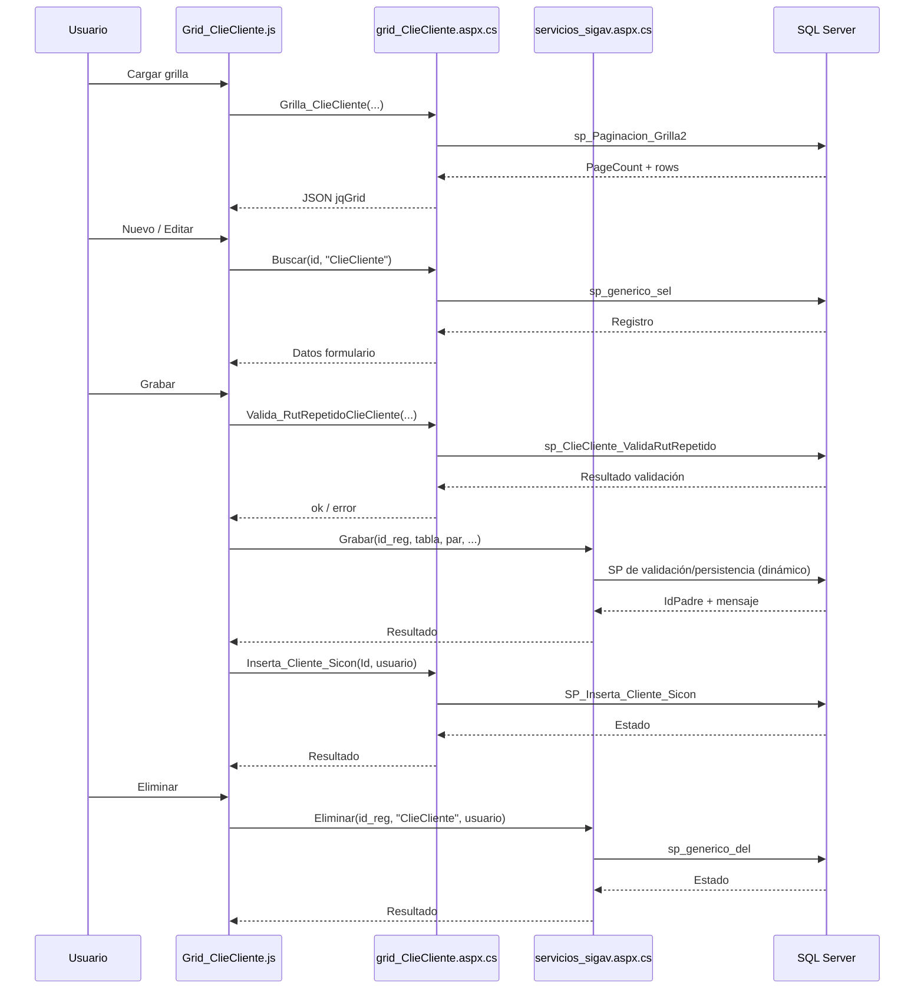

# Análisis de `grid_ClieCliente.aspx`

## 1) Descripción y función

`grid_ClieCliente.aspx` es el componente de mantenimiento de **Clientes** en la capa WebForms.

Su función principal es implementar el flujo CRUD sobre la entidad `ClieCliente` mediante:

- una **grilla jqGrid** para búsqueda, paginación y acciones por fila,
- un **formulario modal** (`Ctrl_ClieCliente.ascx`) para alta/edición/clonación,
- servicios AJAX (`WebMethod`) en `grid_ClieCliente.aspx.cs` y `servicios/servicios_sigav.aspx.cs`.

---

## 2) Artefactos involucrados

### Página y control

- `grid_ClieCliente.aspx`
- `grid_ClieCliente.aspx.cs` (la directiva apunta a `grId_ClieCliente.aspx.cs`, pero en workspace existe `grid_ClieCliente.aspx.cs`)
- `ControlUser/Ctrl_ClieCliente.ascx`
- `ControlUser/Ctrl_ClieCliente.ascx.cs`

### JavaScript principal

- `js/Grid_ClieCliente.js`

### Servicios comunes

- `servicios/servicios_sigav.aspx.cs`

---

## 3) Dependencias JS (objetos y funciones)

## Grilla (`js/Grid_ClieCliente.js`)

- `Grilla_ClieCliente(...)`:
  - inicializa jqGrid,
  - llama por AJAX a `Grid_ClieCliente.aspx/Grilla_ClieCliente`,
  - aplica filtros dinámicos,
  - construye botones de exportación (`Excel`, `CSV`).
- `Accion_ClieCliente(id, accion, idpadre, usuario)`:
  - `0`: Nuevo (`popform_ClieCliente`)
  - `1`: Editar (`popform_ClieCliente`)
  - `2`: Clonar (`popform_ClieCliente`)
  - `3`: Eliminar (`eliminareg`)
  - `4`: Ver detalle (`SubFormJquery` con `form_ClieCliente.aspx`)
- `Caption(...)` y `Filtros(...)`:
  - generan UI de filtros y botones,
  - usan `servicios_sigav.aspx/Caption_Option`.

## Formulario modal (`Ctrl_ClieCliente.ascx`)

- `popform_ClieCliente(...)`: abre modal jQuery UI y orquesta flujo CRUD.
- `BuscarDatos_ClieCliente(...)`: carga datos para edición/clonado (`grid_ClieCliente.aspx/Buscar`).
- `Grabar_ClieCliente(...)`: persiste cambios (`servicios_sigav.aspx/Grabar`).
- `ParametrosGrabar_ClieCliente`, `ParametrosValidacion_ClieCliente`, `ParamValObligatorios_ClieCliente`.
- `DatosValidacion_ClieCliente()`: validación extensa de campos (regex + reglas de negocio).
- `ValidaRutRepetido_ClieCliente(...)`: valida RUT duplicado (`Grid_ClieCliente.aspx/Valida_RutRepetidoClieCliente`).
- `Inserta_Cliente_Sicon(...)`: sincronización posterior (`grid_ClieCliente.aspx/Inserta_Cliente_Sicon`).
- DDL dinámicos (`DDLIdClieEstado`, `DDLIdClieTipoCliente`, `DDLIdMaeSucursal`, etc.) vía `servicios_sigav.aspx/CargaDDL`.

---

## 4) Dependencias C# (métodos y clases)

## `grid_ClieCliente.aspx.cs`

- `Page_Load`:
  - controla autenticación y perfil (`Autentificacion.ValidaPerfil`),
  - registra acceso (`ClassSigav.GrabaLogAccesos`),
  - soporta apertura directa en modo edición por `IdRegistro`.

- WebMethods:
  - `InicializaClieCliente(string idUsuario)`
  - `Buscar(string id_reg, string tabla)`
  - `Grilla_ClieCliente(...)`
  - `Inserta_Cliente_Sicon(string IdClieCliente, string usuario)`
  - `Valida_RutRepetidoClieCliente(...)`
  - `BuscaIdLiBeradoVendedor(string EsLiberado, string usuario)`

- Clases:
  - `ClieCliente` (DTO de entidad)
  - `BtnClieCliente` (mensajes/estado)
  - `JQGridJsonResponse_ClieCliente` (respuesta de jqGrid)

## `ControlUser/Ctrl_ClieCliente.ascx.cs`

- `Inicio()`, `BuscaClieCliente(...)`, `SoloLectura()` para modo visualización.
- Métodos `DLL...` para llenar combos (`sp_llenaDropDown`).

## `servicios/servicios_sigav.aspx.cs`

- `Grabar(...)`: delega validación/persistencia en `ClassForm.Validacion(...)`.
- `Eliminar(...)`: eliminación genérica vía `ClassForm.Eliminacion(..., "sp_generico_del", ...)`.
- `CargaDDL(...)` y `Caption_Option(...)` (usados por combos/filtros del módulo).

---

## 5) Procedimientos almacenados de servidor (detectados)

Directos desde el componente:

- `sp_Paginacion_Grilla2` (listado paginado de grilla)
- `sp_generico_sel` (búsqueda por ID)
- `sp_InicializaClieCliente` (valores iniciales)
- `SP_Inserta_Cliente_Sicon` (sincronización cliente)
- `sp_ClieCliente_ValidaRutRepetido` (regla de duplicidad de RUT)
- `SP_Busca_Liberado_Vendedor` (regla vendedor liberado)

Indirectos/generales usados en el flujo:

- `sp_generico_del` (eliminación genérica, vía `servicios_sigav.aspx/Eliminar`)
- `sp_llenaDropDown` (carga de combos, vía `Ctrl_ClieCliente.ascx.cs`)
- Procedimientos de inserción/actualización invocados desde `ClassForm.Validacion(...)` en `servicios_sigav.aspx/Grabar` (resolución dinámica por tabla/reglas).

---

## 6) Flujo CRUD e interacciones

## Create (Nuevo)

1. Usuario pulsa `Nuevo` en grilla.
2. `Accion_ClieCliente(..., accion=0)` abre `popform_ClieCliente`.
3. Se limpia formulario y se inicializan combos/valores (`InicializaClieCliente` + `CargaDDL`).
4. Usuario ingresa datos.
5. Se ejecuta validación cliente (`DatosValidacion_ClieCliente`) + validación de RUT (`Valida_RutRepetido_ClieCliente`).
6. `Grabar_ClieCliente` llama a `servicios_sigav.aspx/Grabar`.
7. Backend persiste (vía `ClassForm.Validacion`) y devuelve `IdPadre`/mensaje.
8. Se recarga grilla.
9. Se ejecuta `Inserta_Cliente_Sicon` para sincronización adicional.

## Read (Listar / Ver)

- **Listar**:
  - `Grilla_ClieCliente` (JS) llama a `Grilla_ClieCliente` (WebMethod), que usa `sp_Paginacion_Grilla2`.
- **Ver detalle**:
  - acción 4 abre `form_ClieCliente.aspx` en modal (`SubFormJquery`),
  - `Ctrl_ClieCliente.ascx.cs` carga registro con `sp_generico_sel` y aplica `SoloLectura()`.

## Update (Editar)

1. Usuario pulsa `Editar`.
2. Se abre modal y `BuscarDatos_ClieCliente` obtiene datos con `sp_generico_sel`.
3. Usuario modifica campos.
4. Validaciones (incluye RUT repetido).
5. `Grabar` con `accion=1` persiste cambios.
6. Se recarga grilla y se actualiza sincronización Sicon.

## Delete (Eliminar)

1. Usuario pulsa `Eliminar`.
2. `eliminareg` muestra confirmación.
3. Si confirma, llama `servicios_sigav.aspx/Eliminar`.
4. Backend ejecuta `sp_generico_del`.
5. UI muestra mensaje y refresca grilla.

## Clonar

- Acción `2` reutiliza modal/carga de datos y persiste como nuevo registro (según parámetro `accion` y lógica de backend).

---

## 7) Diagrama de objetos (Mermaid)

## 8) Diagrama de proceso CRUD (Mermaid)

---

## 9) Resumen

`grid_ClieCliente.aspx` implementa un CRUD WebForms clásico con:

- jqGrid + AJAX para consulta,
- modal de edición con validaciones front,
- servicios genéricos de persistencia,
- SPs específicos de negocio para reglas de cliente (RUT, vendedor liberado, sincronización Sicon).

Es un componente central, con alta densidad de campos y reglas, y fuerte dependencia de `servicios_sigav.aspx` y procedimientos almacenados genéricos/específicos.
