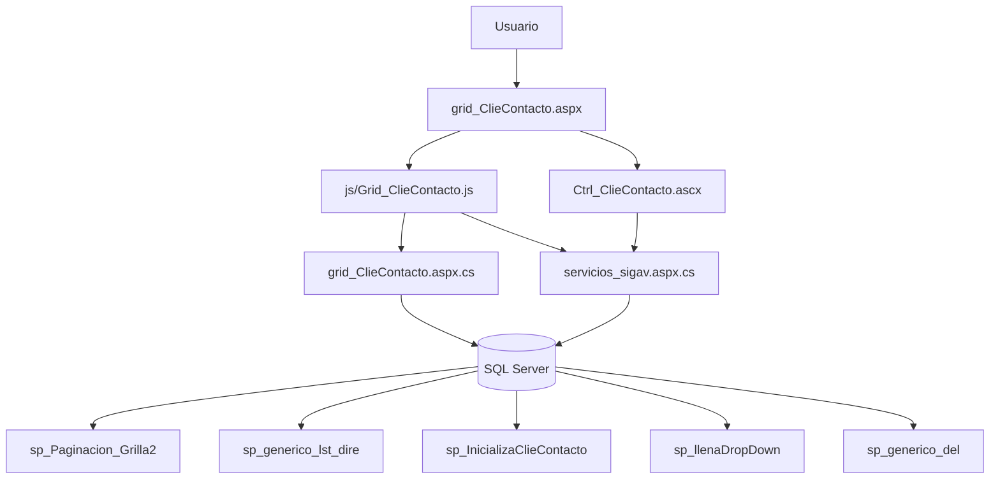
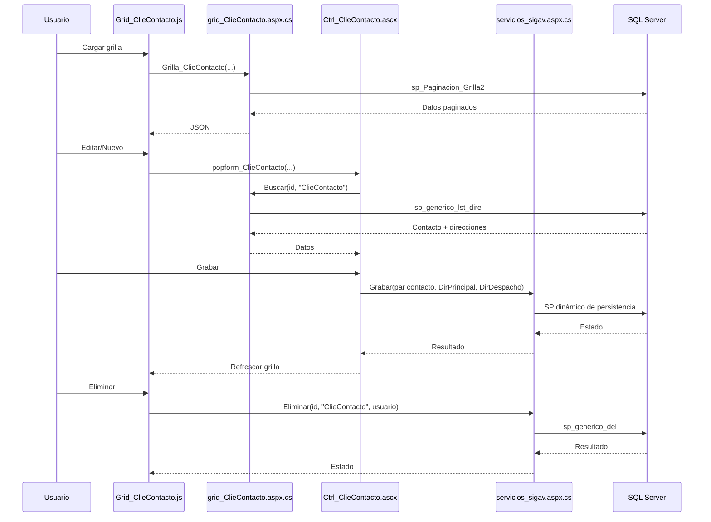

# Análisis de `grid_ClieContacto.aspx`

## Descripción y función

`grid_ClieContacto.aspx` administra el CRUD de contactos de clientes (`ClieContacto`) incluyendo datos de contacto y dos bloques de dirección (principal y despacho).

Funcionalidades:
- grilla `jqGrid` con paginación, filtros y exportación,
- formulario modal con pestañas (`Ctrl_ClieContacto.ascx`),
- persistencia vía servicios genéricos,
- visualización detallada en `form_ClieContacto.aspx`.

---

## Dependencias

### Archivos
- `grid_ClieContacto.aspx`
- `grid_ClieContacto.aspx.cs`
- `js/Grid_ClieContacto.js`
- `ControlUser/Ctrl_ClieContacto.ascx`
- `ControlUser/Ctrl_ClieContacto.ascx.cs`

### Métodos C# relevantes
En `grid_ClieContacto.aspx.cs`:
- `InicializaClieContacto(idUsuario)`
- `Buscar(id_reg, tabla)` (usa `sp_generico_lst_dire`)
- `Grilla_ClieContacto(...)`
- DTO `ClieContacto`
- `JQGridJsonResponse_ClieContacto`

En `servicios/servicios_sigav.aspx.cs`:
- `Grabar(...)`
- `Eliminar(...)`
- `CargaDDL(...)`
- `Caption_Option(...)`

### Objetos JS relevantes
En `Grid_ClieContacto.js`:
- `Grilla_ClieContacto(...)`
- `Accion_ClieContacto(...)`
- `Caption(...)`, `Filtros(...)`

En `Ctrl_ClieContacto.ascx`:
- `popform_ClieContacto(...)`
- `BuscarDatos_ClieContacto(...)`
- `Grabar_ClieContacto(...)`
- `ParametrosGrabar_ClieContacto`, `ParametrosGrabar_DirPrincipal`, `ParametrosGrabar_DirDespacho`
- `DatosValidacion_ClieContacto(...)`
- DDL en cascada para dirección principal/despacho:
  - `DDLPrincipal_IdGeoPais/Ciudad/Comuna`
  - `DDLDespacho_IdGeoPais/Ciudad/Comuna`
  - `DDLIdClieCliente`, `DDLIdClieTipoContacto`

### Procedimientos almacenados detectados
- `sp_Paginacion_Grilla2`
- `sp_generico_lst_dire`
- `sp_generico_sel` (modo detalle en control code-behind)
- `sp_InicializaClieContacto`
- `sp_llenaDropDown`
- `sp_generico_del` (eliminación genérica vía servicio)

---

## Flujo CRUD e interacciones

## Create
1. `Accion_ClieContacto(...,0)` abre modal.
2. Se limpian datos y se inicializan combos (cliente, tipo contacto, geografía principal/despacho).
3. Usuario completa datos de contacto + direcciones.
4. `Grabar_ClieContacto` llama `servicios_sigav.aspx/Grabar` pasando:
   - parámetros del contacto,
   - parámetros de dirección principal,
   - parámetros de dirección despacho.
5. Se refresca grilla.

## Read
- Grilla: `Grid_ClieContacto.aspx/Grilla_ClieContacto` -> `sp_Paginacion_Grilla2`.
- Edit/View: `Buscar` -> `sp_generico_lst_dire` para recuperar contacto y direcciones.
- En modo visualización, `Ctrl_ClieContacto.ascx.cs` carga por `sp_generico_sel` y deshabilita controles.

## Update
1. `Accion_ClieContacto(...,1)` abre modal.
2. `BuscarDatos_ClieContacto` hidrata campos y combos.
3. Validaciones (`DatosValidacion_ClieContacto`) y grabación.
4. `Grabar` actualiza registro y direcciones relacionadas.

## Delete
1. Acción 3 -> `eliminareg`.
2. Confirmación + `servicios_sigav.aspx/Eliminar`.
3. Persistencia por `sp_generico_del`.
4. Recarga de grilla.

## Clone / View
- `accion=2`: clonado de registro reutilizando flujo de edición.
- `accion=4`: abre formulario de solo lectura.

---

## Diagrama de objetos

## Diagrama de proceso CRUD

