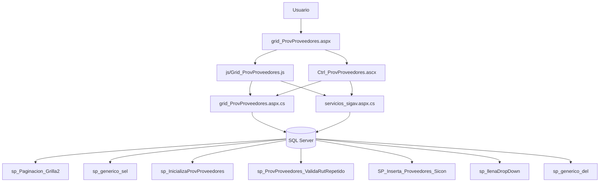
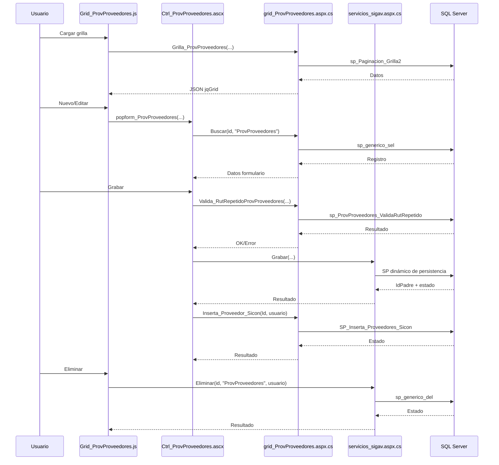

# Análisis de `grid_ProvProveedores.aspx`

## Descripción y función

`grid_ProvProveedores.aspx` es el componente de mantenimiento de proveedores (`ProvProveedores`) en el módulo de maestros de proveedores.

Cubre un CRUD amplio con reglas de negocio adicionales:
- validación de RUT,
- validación de RUT repetido,
- sincronización posterior con SICON,
- múltiples parámetros comerciales/contables y geográficos.

---

## Dependencias

### Archivos
- `grid_ProvProveedores.aspx`
- `grid_ProvProveedores.aspx.cs`
- `js/Grid_ProvProveedores.js`
- `ControlUser/Ctrl_ProvProveedores.ascx`
- `ControlUser/Ctrl_ProvProveedores.ascx.cs`

### Métodos C# (WebMethods)
En `grid_ProvProveedores.aspx.cs`:
- `InicializaProvProveedores(idUsuario)`
- `Buscar(id_reg, tabla)`
- `Grilla_ProvProveedores(...)`
- `Inserta_Proveedor_Sicon(IdProvProveedores, usuario)`
- `Valida_RutRepetidoProvProveedores(IdProvProveedores, Rut, usuario)`
- DTO `ProvProveedores`
- `JQGridJsonResponse_ProvProveedores`

En `servicios/servicios_sigav.aspx.cs`:
- `Grabar(...)`
- `Eliminar(...)`
- `CargaDDL(...)`
- `Caption_Option(...)`

### JS principales
En `Grid_ProvProveedores.js`:
- `Grilla_ProvProveedores(...)`
- `Accion_ProvProveedores(...)`
- `Caption(...)`, `Filtros(...)`

En `Ctrl_ProvProveedores.ascx`:
- `popform_ProvProveedores(...)`
- `BuscarDatos_ProvProveedores(...)`
- `Grabar_ProvProveedores(...)`
- `ParametrosGrabar_ProvProveedores`, `ParametrosValidacion_ProvProveedores`, `ParamValObligatorios_ProvProveedores`
- `Valida_RutRepetidoProvProveedores(...)`
- `Inserta_Proveedor_Sicon(...)`
- `InicializaProvProveedores(...)`
- múltiples `DDL...` para combos dependientes.

### SP detectados
- `sp_Paginacion_Grilla2`
- `sp_generico_sel`
- `sp_InicializaProvProveedores`
- `SP_Inserta_Proveedores_Sicon`
- `sp_ProvProveedores_ValidaRutRepetido`
- `sp_llenaDropDown`
- `sp_generico_del` (vía servicio genérico)

---

## Flujo CRUD e interacciones

## Create
1. `Accion_ProvProveedores(...,0)` abre modal.
2. Inicializa combos y valores por defecto (`InicializaProvProveedores` + `CargaDDL`).
3. Validación de campos (`DatosValidacion_ProvProveedores`) y RUT (`$.Rut.validar`).
4. Validación de duplicidad de RUT (`Valida_RutRepetidoProvProveedores`).
5. `Grabar_ProvProveedores` llama `servicios_sigav.aspx/Grabar` con gran set de parámetros.
6. Al éxito, refresca grilla y ejecuta `Inserta_Proveedor_Sicon`.

## Read
- Grilla: `Grilla_ProvProveedores` -> `sp_Paginacion_Grilla2`.
- Edición/detalle: `Buscar` -> `sp_generico_sel`.
- Vista detalle (`accion=4`) abre formulario en modo de solo lectura.

## Update
1. `Accion_ProvProveedores(...,1)`.
2. `BuscarDatos_ProvProveedores` llena campos y flags.
3. Mismas validaciones que alta.
4. `Grabar` con `accion=1` persiste cambios.
5. Se sincroniza con SICON.

## Delete
1. `Accion_ProvProveedores(...,3)` -> `eliminareg`.
2. Confirmación y llamada a `servicios_sigav.aspx/Eliminar`.
3. Persistencia por `sp_generico_del`.
4. Recarga de grilla.

## Clone / View
- `accion=2`: clona registro reutilizando flujo modal.
- `accion=4`: visualización en `form_ProvProveedores.aspx`.

---

## Diagrama de objetos

## Diagrama de proceso CRUD

